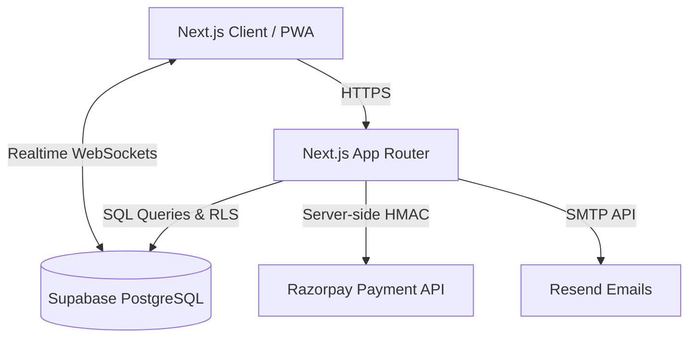
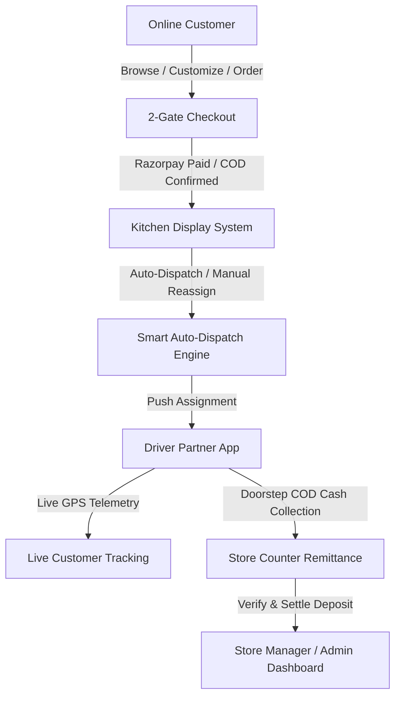
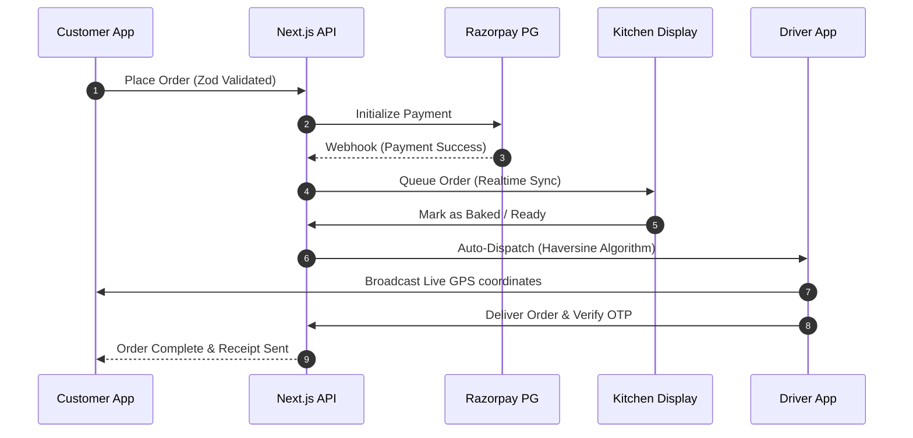
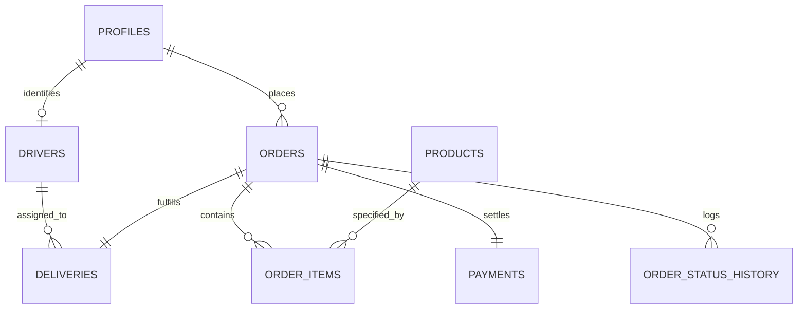

# Product Requirement Document (PRD)
## Pizza Expert Prayagraj
**Version:** 2.4.0 (Production Release)  
**Status:** Approved & Implemented  
**Lead Engineering:** DeepMind & Antigravity IDE  
**Target Market:** Prayagraj, Uttar Pradesh (Allapur, Civil Lines, Katra, Naini, Teliyarganj)  
**Repository:** [github.com/Pratyush-Malviya/pizza-expert-prayagraj](https://github.com/Pratyush-Malviya/pizza-expert-prayagraj)

---

## 1. Executive Summary & Vision

**Pizza Expert Prayagraj** is a vertically integrated, hyper-local food-tech platform engineered to deliver artisanal wood-fired sourdough pizzas with industry-leading speed, transparency, and operational efficiency across Prayagraj, Uttar Pradesh.

Unlike traditional aggregator-dependent restaurants (Zomato/Swiggy) that suffer from 25–35% commission leakages and opaque delivery timelines, Pizza Expert operates as an end-to-end direct-to-consumer (D2C) ecosystem. The platform seamlessly interlinks:

1. **High-Speed Customer E-Commerce Storefront:** Ultra-responsive Next.js 16 App Router storefront with smart cart, customized crust builders, QR dine-in ordering, and Razorpay payment verification.
2. **Kitchen Display System (KDS):** Real-time digital line-cook management with automated ticket preparation timers, oven capacity allocation, and bidirectional fleet handoff.
3. **Smart Multi-Factor Auto-Dispatch Engine:** Automated rider assignment based on Haversine geographic proximity to the Allapur store hub, driver active workload, and delivery SLA forecasting.
4. **Strict Financial Control & Cash Remittance:** Enforced Razorpay signature verification gates prior to kitchen queuing, doorstep Cash on Delivery (COD) collection enforcement, and Store Manager counter remittance reconciliation.
5. **Sub-Second GPS Telemetry & Customer Tracking:** Live Leaflet map streaming driver coordinates, milestone tracking, and 4-digit cryptographic OTP handshakes.

---

## 2. System Architecture & Technology Stack

| Layer | Technology / Service | Architectural Purpose |
| :--- | :--- | :--- |
| **Frontend Framework** | Next.js 16.3.0 (Turbopack, App Router) | Server-side rendering (SSR), static generation for 51 production routes, edge API routes, dynamic metadata, and lightning-fast client hydration. |
| **Styling & Design System** | Tailwind CSS + Vanilla CSS Tokens | Artisanal wood-fired theme (`#B91C1C` Crimson, `#1C1917` Charcoal, `#FBF9F5` Cream), zero layout shifts, mobile-first responsive UX. |
| **Database & Auth** | Supabase (PostgreSQL 15 + RLS) | Relational integrity across orders, products, deliveries, drivers, and payments with Row-Level Security (RLS) policies. |
| **Realtime Subscriptions** | Supabase Realtime (WebSockets) | Sub-second event streaming across channels (`tracking-${orderId}`, `kitchen-kds`, `admin-deliveries-live`, `driver-partner-${id}`). |
| **Payment Gateway** | Razorpay PG + Cash on Delivery (COD) | UPI, NetBanking, Credit/Debit Cards, Automated Webhook Signature Verification, and 2-phase COD phone verification for high-ticket orders. |
| **Mapping & GPS Radar** | Leaflet + OpenStreetMap + HTML5 Geolocation | Interactive vector radar, breadcrumb tracking, Prayagraj road corridors, dynamic distance calculations, and real-time rider interpolation. |
| **Transactional Email** | Resend API | Transactional order receipts, store owner instant email alerts, and customer notifications. |
| **Audio Notification Engine** | Web Audio Context API | Custom multi-frequency chimes (kitchen chime, alert gong, success chime) that work cross-browser without external MP3 dependencies. |

---

## 3. User Personas & Role-Based Access Control (RBAC)

### Roles Breakdown:
1. **Public Customer (`/`, `/menu`, `/track`, `/account`):**
   - Discovers pizzas, customizes crust/toppings, pays online or via COD, tracks live GPS delivery, earns loyalty points, and leaves reviews.
2. **Kitchen Chef / Line Cook (`/admin/kitchen`):**
   - Operates the KDS screen, monitors baking timers, manages oven queues, views assigned delivery partner badges, and hands off orders.
3. **Delivery Partner / Rider (`/partner/deliveries`, `/driver`):**
   - Receives auto-dispatched trips, broadcasts live GPS coordinates, collects COD cash/UPI at doorstep, verifies 4-digit OTP, and deposits cash at store counter.
4. **Store Manager & Super Admin (`/admin`, `/admin/payments`, `/admin/deliveries`):**
   - Oversees fleet radar, settles rider COD cash remittances, manages inventory/coupons, audits financial ledgers, and views sales analytics.

---

## 4. Detailed Feature Specifications & Workflows

### End-to-End Data Flow Diagram

### 4.1 Customer Storefront & E-Commerce Module
- **Artisanal Pizza Menu:** Categorized by Classics, Gourmet Specials, Wood-Fired Sourdough, Sides & Beverages with Veg/Non-Veg indicators, spice level badges, and nutritional details.
- **Dynamic Product Customizer:** Crust selection (Hand-Tossed, Thin Crust, Cheese Burst, Sourdough), size variations (7" Regular, 10" Medium, 12" Large), extra toppings, and custom chef notes.
- **Dine-In QR Table Ordering (`/dine-in/[tableId]`):** Allows in-store patrons to scan physical table QR codes, order directly to the kitchen, and pay digitally without waiting for waitstaff.
- **Abandoned Cart Recovery System:** Automated background cron job (`/api/cron/abandoned-cart`) that identifies abandoned checkouts and triggers recovery email reminders.
- **Loyalty & Rewards Program:** Customers earn 10 points per ₹100 spent, unlocking tiered badges (Bronze, Silver, Gold, VIP Pizza Connoisseur) with instant redemption at checkout.

---

### 4.2 Strict 2-Gate Payment & Checkout Engine

| Payment Method | Initial DB Status | Verification Mechanism | Trigger to Kitchen & Auto-Dispatch |
| :--- | :--- | :--- | :--- |
| **Razorpay (Online UPI/Card)** | `pending` | Server-side HMAC-SHA256 signature verification in `verifyRazorpayPayment`. | **Strict Gate:** Order is confirmed, sent to KDS, and dispatched to driver *only after* payment is successfully verified. |
| **Cash on Delivery (Standard)** | `confirmed` | Standard checkout (< ₹1,000 threshold); assigned initial OTP. | Immediately queued to kitchen KDS and auto-dispatched to nearest rider. |
| **Cash on Delivery (High Value)** | `cod_pending` | Orders ≥ ₹1,000 enter verification queue for store manager phone confirmation. | Queued to kitchen only after store manager confirms order via admin panel. |

---

### 4.3 Kitchen Display System (KDS) & Operations Hub
- **4 Real-Time Kanban Stages:** `Confirmed (New Orders)` ➔ `In Oven (Baking)` ➔ `Out for Delivery` ➔ `Delivered`.
- **Preparation Timers:** Dynamic timer on every ticket showing elapsed preparation time with color-coded alerts (Normal &lt;10m, Warning 10-15m, Critical &gt;15m).
- **Interconnected Rider Badges:** Every ticket displays:
  - `🛵 Rider Name • Vehicle • Phone` (e.g. *🛵 Amit Kumar • Bike (UP 70 AB 1234) • +91 9876543210*)
  - 4-Digit Delivery Verification OTP code.
  - Rider readiness status (*Waiting at Kitchen Pass* vs *En Route to Store*).
- **1-Click Auto-Dispatch & Manual Override:** Chefs can 1-click auto-dispatch or manually reassign any idle driver directly from the kitchen ticket.
- **Audio Context Chimes:** Plays a wood-fired kitchen chime on new incoming orders and alert sound on urgent notifications.

---

### 4.4 Enterprise-Grade Security & Audit Logging
To protect the system from unauthorized manipulation, all sensitive administrative operations (e.g., closing shifts, voiding orders, adjusting inventory) are protected by a strict, multi-layered defense system:
1. **Centralized Authentication & RBAC:** Every Server Action intercepts the request and verifies the caller's role (e.g., `cashier`, `manager`, `super_admin`) before executing any logic.
2. **Strict Zod Payload Validation:** All incoming data is parsed against strict schema definitions. Malformed data (e.g., negative cash amounts) triggers an immediate rejection, preventing database corruption.
3. **Immutable Audit Ledger:** Critical actions are permanently recorded in an `admin_action_log` table with Row-Level Security (RLS) policies that prohibit modifications or deletions, ensuring a tamper-proof trail of *who* performed *what* action.

---

## 5. Fleet Management, Auto-Dispatch & Driver App

### 5.1 Smart Multi-Factor Auto-Dispatch Engine
The auto-dispatch engine (`app/actions/deliveries.ts`) evaluates all registered and online drivers across Prayagraj using a multi-factor ranking algorithm:

$$\text{Candidate Score} = (\text{IsBusy} \times 50) + \text{HaversineDistance}(\text{StoreHub}, \text{DriverLocation})$$

- **Allapur Store Geographic Hub:** Latitude `25.4358`, Longitude `81.8682`.
- **Batch Dispatch Engine:** Store managers can click "Auto-Dispatch All" to simultaneously assign all unassigned queue orders to available drivers in under 500ms.
- **Instant Queue Recirculation:** When a driver completes an order, the system automatically checks the pending queue and auto-assigns the next waiting order to that newly freed driver.

---

### 5.2 Driver Partner Progressive Web App (`/partner/deliveries`)

| Step | Stage | Driver Action | System Event & Customer Synchronization |
| :---: | :--- | :--- | :--- |
| **1** | **Assigned** | Rider receives dispatch alert & reviews order items, total, and customer location. | Rider clicks "Accept Delivery Trip" ➔ System updates status to `accepted`. |
| **2** | **Picked Up** | Rider collects packed hot pizza box from Allapur kitchen pass. | Rider clicks "Confirm Food Picked Up" ➔ KDS & Order status sync to `out_for_delivery`. |
| **3** | **En Route** | Rider starts bike ride toward customer address. | GPS broadcasting activates; live coordinates stream to customer Leaflet map. |
| **4** | **Arrived** | Rider reaches customer doorstep in Prayagraj. | Rider clicks "Arrived at Doorstep" ➔ Customer notified via app and SMS. |
| **5** | **Payment & Delivery** | **Mandatory COD Payment Gate:** Rider collects Cash/UPI, checks collection box, enters customer 4-digit OTP. | System validates OTP & COD collection ➔ Marks order `delivered`, records payment, frees rider, and adds cash to driver ledger. |

---

## 6. Financial Integrity, COD Remittance & Store Settlement

> [!IMPORTANT]
> **COD Cash Remittance Workflow Rule:** All Cash on Delivery (COD) funds collected by delivery partners at customer doorsteps are strictly tracked in a live "Cash-in-Hand Ledger" and must be deposited at the store counter to the Store Manager upon return.

### Financial Control Breakdown:
1. **Rider Cash in Hand Tracking:**
   - Displays total unremitted cash collected in hand: `₹[Amount]`.
   - Itemized list of delivered COD orders waiting for counter deposit.
   - Clear policy banner reminding rider to deposit funds upon return to Allapur hub.
2. **Store Manager Counter Settlement (`/admin/payments`):**
   - Dedicated **COD Cash Remittance** tab.
   - Displays each driver's total unremitted cash balance.
   - 1-Click **"Accept & Settle Cash (₹[Amount])"** clears driver ledger to ₹0.
   - Updates payment record to `settled_at_store` with manager audit trail.

---

## 7. Database Schema & Data Models

### Key PostgreSQL Tables:
- **`orders`**: `id` (UUID PK), `user_id` (FK), `status` (TEXT: pending, confirmed, preparing, out_for_delivery, delivered, cancelled), `subtotal`, `tax`, `delivery_fee`, `discount`, `total`, `address_json` (JSONB), `notes`, `created_at`.
- **`deliveries`**: `id` (UUID PK), `order_id` (FK to `orders.id` UNIQUE), `driver_id` (FK to `drivers.id`), `status` (TEXT: unassigned, assigned, accepted, picked_up, heading_to_customer, arrived, delivered), `otp_code` (TEXT), `pickup_time`, `delivered_time`, `updated_at`.
- **`drivers`**: `id` (UUID PK to `profiles.id`), `name`, `phone`, `vehicle_type`, `vehicle_number`, `is_online`, `is_busy`, `current_lat`, `current_lng`, `last_location_update`.
- **`payments`**: `id` (UUID PK), `order_id` (FK to `orders.id` UNIQUE), `gateway` (TEXT: razorpay, cod), `gateway_order_id`, `gateway_payment_id`, `amount` (NUMERIC), `status` (TEXT: pending, paid, failed, refunded), `created_at`.
- **`order_items`**: `id` (UUID PK), `order_id` (FK), `product_id` (FK), `quantity` (INT), `unit_price` (NUMERIC), `selected_options` (JSONB).
- **`order_status_history`**: `id` (UUID PK), `order_id` (FK), `status` (TEXT), `notes` (TEXT), `created_at` (TIMESTAMPTZ).

---

## 8. Service Level Agreements (SLAs) & Benchmarks

### Operational SLAs:
- **Order Confirmation to Oven Fire:** &lt; 3 minutes.
- **Oven Baking Duration:** 5–7 minutes at 450°C.
- **Kitchen Pass to Rider Pickup:** &lt; 2 minutes.
- **Rider Transit to Customer Doorstep:** 12–18 minutes across Prayagraj.
- **Total Order-to-Delivery SLA:** &lt; 30 minutes guaranteed.

### Technical Performance Targets:
- **Page Load Time (LCP):** &lt; 1.2 seconds on 4G networks.
- **WebSocket Telemetry Latency:** &lt; 250 milliseconds.
- **Build Route Completeness:** 51/51 routes compiling with 0 TypeScript errors.
- **Financial Cash Reconciliation:** 100% accurate with 0 unverified COD discrepancies.

---

## 9. Release Sign-Off & Verification

| Module | Status | Verification Evidence |
| :--- | :---: | :--- |
| **E-Commerce & Smart Cart** | ✅ **Verified** | Cart store, dynamic customization, PIN zone validation, and instant coupon application. |
| **Razorpay Verification Gate** | ✅ **Verified** | Server-side HMAC validation in `app/actions/razorpay.ts` before KDS queuing. |
| **Kitchen Display System (KDS)** | ✅ **Verified** | Live stage transitions, preparation timers, and rider badges in `app/admin/kitchen/page.tsx`. |
| **Fleet Command & Auto-Dispatch** | ✅ **Verified** | Haversine algorithm, batch dispatch, and manual reassign in `app/actions/deliveries.ts`. |
| **Driver App & Doorstep COD Gate** | ✅ **Verified** | 5-step trip flow, COD payment check, and OTP handshake in `app/partner/deliveries/page.tsx`. |
| **Store Manager COD Settlement** | ✅ **Verified** | Driver cash-in-hand ledger and counter settlement panel in `app/admin/payments/page.tsx`. |
| **Live GPS Customer Tracking** | ✅ **Verified** | Real-time Leaflet map and driver telemetry in `app/(public)/track/page.tsx`. |

---

*Document compiled and verified for Pizza Expert Prayagraj v2.4.*
