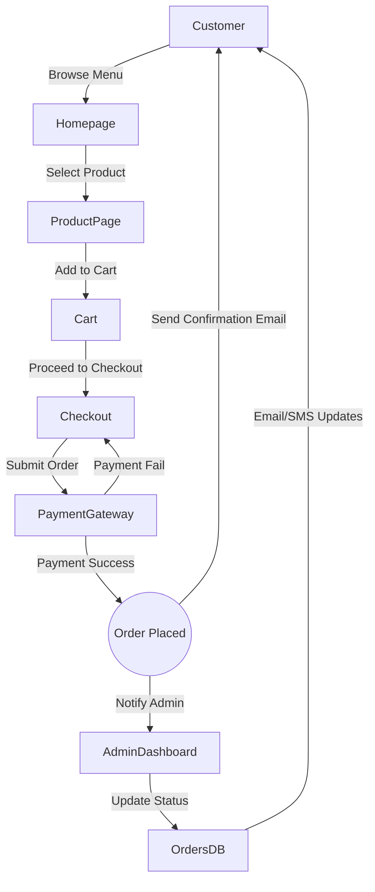

# Pizza Expert Prayagraj Website – Project Specification

**Executive Summary:** Pizza Expert Prayagraj is a local fast-food pizzeria (Allapur, Prayagraj, UP) with excellent customer reviews (4.9/5 on Google). We will build a premium, SEO-optimized online ordering website inspired by the **Pizzaro WooCommerce theme**. Pizzaro is designed specifically for pizza and fast-food restaurants, featuring bold hero banners, menu showcases, and integrated online ordering. The new site will use Pizza Expert’s branding (logo, colors) while adopting Pizzaro’s clean layout, typography, and components. It will boost online orders, improve Google visibility, reduce reliance on delivery apps, and offer features like online payments, WhatsApp chat, loyalty, and CRM. This document provides a detailed roadmap: pages, features, UI specs, color/fonts, components, data flows, integrations (Razorpay, Cashfree, Google Maps/Reviews, Instagram, WhatsApp, analytics), SEO/performance requirements, accessibility, testing, deployment, and admin panel design. All decisions are aligned with industry best practices and the user’s guidance for “SaaS-quality”, production-ready code (Next.js/React/TypeScript, Tailwind CSS, Supabase, etc.).  

## Project Overview

Pizza Expert Prayagraj is a single-location pizzeria offering dine-in and delivery. The website objectives are to: 
- Showcase the menu (pizzas, burgers, beverages, combos, etc.) with high-quality images and descriptions.
- Enable **online ordering** directly (mobile-friendly cart/checkout).
- Integrate digital **payments** (Razorpay, Cashfree) and **WhatsApp orders**.
- Reduce reliance on third-party apps by offering an easy ordering flow.
- Improve **Google visibility and SEO** (structured data for restaurant, menu, etc.).
- Build brand identity (consistent colors, fonts from Pizzaro theme and Pizza Expert signage).
- Collect customer data for marketing (accounts, newsletters, loyalty).
- Provide content (about, blog, FAQs) for SEO and engagement.
- Ensure high **performance** and compliance (Core Web Vitals, WCAG2.1 AA accessibility).
- Prepare for future expansion (multi-restaurant platform, franchises).

## Goals

- **Increase Direct Orders:** Streamline online ordering and payments, feature promotions/coupons.
- **Branding & Trust:** Use Pizza Expert logo/signage colors (dark blue background with white/yellow text) and high-quality food imagery for a premium feel.
- **SEO & Visibility:** Fast, responsive site with structured data (Restaurant, Menu, FAQ schema), optimized for Google search.
- **Conversion & Retention:** Add loyalty program, email/SMS marketing, subscription and referral features for future growth.
- **Operational Efficiency:** Enable menu/offers management, order tracking, and analytics through an admin interface.

## Scope and Site Map

We will build the following **public-facing pages and features** (plus corresponding mobile versions):

- **Home (Landing) Page:** Hero banner, highlights (e.g. “Pizza of the Day”), featured categories (Pizzas, Burgers, Pasta, Beverages, etc.), promo banners (deals, coupons), Instagram feed, Google rating, testimonials, FAQ snippet, and call-to-action (Order Now, Contact).
- **Menu / Products:** Category list (Pizza, Burgers, Sides, Combos, etc.). Each category shows menu items (image, name, price, description, veg/spicy badges). Filters by veg/non-veg, price, popularity. Search bar.
- **Product Page:** Detailed view for each menu item (large image + gallery, description, ingredients, nutrition info, customization options like size/crust/extras, quantity, price, ratings, reviews, related items, Add-to-Cart button, and Buy Now/WhatsApp Order).
- **Offers & Combos:** Special deals page listing current coupons, combo meals, festival offers, weekend discounts.
- **About Us:** Restaurant story, mission, values, chef/team photos, facility images (gallery), why choose us (quality, service).
- **Contact:** Store location (Google Map embed), address, phone, WhatsApp link, email, operating hours, and contact form.
- **Gallery:** Food and restaurant photos, possibly video section, social media feed.
- **Reviews/Testimonials:** Aggregated Google Reviews (via Places API) and site testimonials.
- **Blog/News:** Articles (pizza recipes, ordering tips, events) for SEO.
- **Careers:** Job openings and application form (optional).
- **Franchise/Partners:** Information form for franchising inquiries.
- **FAQs:** Answer common questions (delivery, payment, refund, etc.) in collapsible panels (with FAQ schema).
- **Policy Pages:** Terms & Conditions, Privacy Policy, Refund Policy, Shipping Info.

**Admin Dashboard (protected):**  

- **Login/Users:** Admin and staff accounts (role-based access).
- **Dashboard:** Sales overview, order stats, top products, new reviews, site visitors (via analytics), pending tasks.
- **Orders Management:** List/filter orders, view details (items, customer, status), change status (Pending→Cooking→Out for Delivery→Completed), issue refunds, print invoices.
- **Product/Menu Management:** CRUD for categories and products (name, price, images, description, extras, veg/spicy flag, nutrition, availability).
- **Offers/Coupons:** Create and manage discounts (percentage or fixed), combos, bundle deals, limited-time offers, coupon codes.
- **Customers:** View registered users, order history, addresses, loyalty points.
- **Reviews:** Moderate customer reviews (approve, respond).
- **Content/CMS:** Manage homepage sections (enable/disable blocks), static pages (About, Contact), blog posts (CRUD), gallery images.
- **Analytics:** Sales reports, daily/weekly stats, source tracking (Google Analytics).
- **Integrations Config:** Enter API keys and settings for Razorpay, Cashfree, Google Maps/Reviews, Instagram, WhatsApp, Meta Pixel.
- **Notifications:** Configure email/SMS templates for order confirmation, status updates, newsletters.
- **Settings:** Business info (name, logo, contact), hours, tax rates, delivery charges, payment options, social links.
- **Security & Logs:** Audit log of admin actions, data backups, system health.
- **API Endpoints:** Document and secure REST/GraphQL APIs for frontend (authentication, products, orders, payments, etc.).
- **Database:** Schema with tables and relations (see Entity Relationship Diagram below).  

**Public vs. Admin Features (Summary Table):** 

| Feature / Section             | Customer (Public) | Admin Panel      |
|-------------------------------|:-----------------:|:----------------:|
| Browse menu & categories      | ✔️                | –                |
| Search & filter products      | ✔️                | –                |
| Product detail & customization| ✔️                | –                |
| Add to cart / Wishlist        | ✔️                | –                |
| Checkout & online payment     | ✔️                | –                |
| Order tracking (status view)  | ✔️ (via link)     | ✔️ manage orders |
| Coupons & deals               | ✔️                | ✔️ create/manage |
| Customer registration/login   | ✔️                | –                |
| Customer profile & addresses  | ✔️                | –                |
| Reviews & ratings             | ✔️ (submit)       | ✔️ moderate      |
| View store info & FAQs        | ✔️                | –                |
| Contact form                  | ✔️                | ✔️ view messages |
| Blog/News                     | ✔️ read           | ✔️ CRUD posts    |
| Newsletter subscription       | ✔️                | ✔️ send emails   |
| Site analytics (visitors)     | –                 | ✔️ dashboard     |
| Manage products & menu        | –                 | ✔️              |
| Manage orders & customers     | –                 | ✔️              |
| Manage coupons & promotions   | –                 | ✔️              |
| Manage pages/content/CMS      | –                 | ✔️              |
| System settings (tax, hours)  | –                 | ✔️              |
| Payment config                | –                 | ✔️ (keys)        |
| View financial reports        | –                 | ✔️              |

## Site Map

| Page / Path             | Public/Admin | Key Sections / Components                                             |
|-------------------------|:------------:|----------------------------------------------------------------------|
| **Home (`/`)**         | Public       | Hero Banner with CTA (Order), Featured categories/products carousel, Special deals tiles, Best sellers, New combos, Instagram feed, Google reviews summary, FAQ highlights, Footer with contact/social links. |
| **Menu (`/menu`)**     | Public       | Category tabs (Pizza, Burgers, Pasta, Sides, Beverages, etc.), Search bar, Filters (Veg only, price range, popular), Grid of product cards (image, name, price, veg/non-veg tag, Add to Cart). |
| **Product (`/product/{id}`)** | Public   | Large image + carousel, title, rating, description, ingredients, nutrition facts, price, customization (size, crust, extras, toppings, quantity), “Add to Cart” & “Buy Now” buttons, Social share, Reviews, Related items. |
| **Offers (`/offers`)** | Public       | Listing of current coupons/deals: bakery/festive combos, meal deals, BOGO specials. Filters by type (Weekend, Festival, New). Each with image, description, expiry, CTA to apply or order. |
| **About (`/about`)**   | Public       | Company story, mission, team/chef photos, kitchen cleanliness, fresh ingredients highlight, hours, location map, infographic cards (quality, delivery, awards). |
| **Contact (`/contact`)** | Public     | Google Map embed of store, full address (Allapur, Prayagraj), phone, WhatsApp chat button, email, opening hours table, contact form (name, email, message). |
| **Gallery (`/gallery`)** | Public     | Photo gallery of pizzas, burgers, interiors, chef, customers; optional video embed or 360° tour. |
| **Reviews (`/reviews`)** | Public      | Display Google/FB reviews feed (via Places API), average rating (4.9★), customer testimonials slider. |
| **Blog (`/blog`)**     | Public       | List of articles (recipes, news, pizza tips), categories, search; blog post detail pages with image, content, social share. |
| **Careers (`/careers`)** | Public     | Job listings (position, description, apply form or email link). Optional. |
| **Franchise (`/franchise`)** | Public  | Info for potential investors, form to request info. Optional. |
| **FAQs (`/faq`)**      | Public       | Accordion Q&A (delivery, payment, order changes, refunds); properly coded for FAQ schema. |
| **Policies**           | Public       | Static pages: Terms (`/terms`), Privacy (`/privacy`), Refund/Shipping. |
| **Customer Account (`/account`)** | Public (authenticated) | Login/Register, profile, saved addresses, order history, loyalty points. |
| **Cart (`/cart`)**     | Public (authenticated/guest) | List of items, quantities (editable), subtotal, shipping, tax, discount code entry, Proceed to Checkout button. |
| **Checkout (`/checkout`)** | Public (authenticated/guest) | Checkout form: contact info, delivery address (with Google Autocomplete), payment options (Razorpay, Cashfree, COD), order summary, Place Order. |
| **Order Confirmation (`/order/{id}`)** | Public (authenticated) | Confirmation message, order summary, tracking link, estimated delivery. |
| **Track Order (`/track`)** | Public    | Input order ID or phone, shows current status (if integrated with SMS/WhatsApp API for real-time updates). |
| **Error Pages**        | Public       | 404 Not Found, 500 Server Error (styled consistently). |
| **Admin Dashboard (`/admin`)** | Admin    | Login page. After auth: dashboard overview (sales, orders, charts), main navigation. |
| **Admin Orders (`/admin/orders`)**  | Admin | Orders list (filter by status/date), detailed view, status update, refund processing. |
| **Admin Products (`/admin/products`)** | Admin | Manage categories & products: forms to add/edit items, upload images, set prices, nutritional info, customization options. |
| **Admin Offers/Coupons (`/admin/offers`)** | Admin | Create/edit deals and coupons (code, discount type/amount, validity). |
| **Admin Customers (`/admin/customers`)** | Admin | View registered users and their orders, edit profiles, manage addresses. |
| **Admin Content (`/admin/cms`)** | Admin | Edit homepage blocks, about/contact text, policy pages, blog posts, gallery images. |
| **Admin Settings (`/admin/settings`)** | Admin | Business info (name, logo), contact, hours, tax & delivery settings, payment gateways config, social links, analytics code, roles/permissions. |

## Page-by-Page UI & Content Specification

Below is a high-level breakdown of major pages with their sections, content fields, UI components, and behaviors. All layouts should be **responsive** (mobile-first). Where applicable, indicate how sections collapse or reorder on narrow screens.

### Home Page

**Hero Section:**  
- Full-width banner (image or video background) of a signature pizza.  
- Overlay text: Headline (“ORDER YOUR FAVORITE PIZZA!” or current promotion), subheading (e.g. “Fresh. Hot. Delivered Fast.”), and primary CTA button (“Order Now”, triggers smooth scroll to menu or opens menu modal).  
- Possibly secondary CTA (e.g. “View Menu”).  
- If on mobile, banner height reduces (no more than 60vh), text centered, CTA large.

**Featured Promotions:**  
- Horizontal cards or tiles (3-4) showing daily specials (e.g. “Pizza of the Day $9.99”, “Free Fries with Pizza”, “Iced Coffee Combo”).  
- Each tile: image or colored background, short title, price or badge, “Order Now” button.  
- Carousel or grid depending on screen size. Use hover animations (lift or zoom).  
- Example: Pizzaro theme uses similar promo cards.

**Category Tabs / Highlights:**  
- Tabs like “Pizza”, “Burgers”, “Pasta”, “Sandwiches”, etc.  
- Under each tab, 3 featured items (image + name + price).  
- “See All” link goes to full category page.  
- On mobile, tabs become a vertical scroll list or dropdown.

**Best Sellers / Popular Items:**  
- Grid of top-selling products (photo, name, short desc, price, Add-to-Cart).  
- Hover shows quick view (Add, favorite, share icons).  
- “Load More” or pagination optional for mobile UX.

**Combo Meals / Bundles:**  
- Showcase combo deals in wide banner or cards (e.g., “Family Combo: 2 Large Pizzas + Drinks”).  
- CTA to apply coupon or go to menu.

**Gallery / Instagram Feed:**  
- Gallery slider with Instagram images (automatically fetched from Pizza Expert’s feed). Title “Follow us @pizzaexpert.in”.  
- Encourage tag sharing. Each item clickable to Instagram.

**Testimonials/Reviews:**  
- Carousel of customer testimonials (with name initials or photo), star ratings.  
- Include a summary line like “Rated 4.9/5 on Google★”.  
- Link to Google Business or reviews page.

**Restaurant Features:**  
- Icon cards (4 cols): e.g. “Best Quality”, “On Time Delivery”, “Master Chefs”, “Tasty Food” (as in Pizzaro footer).  
- Simple icon + short text.

**FAQs (Snippet):**  
- A few top FAQs listed with expandable answers (Accordion).  
- “See all FAQs” link to FAQ page.

**Footer:**  
- Dark background (black or dark gray).  
- Columns: Logo + brief “Pizza Expert - Love at first slice.”, Quick Links (Home, Menu, About, Blog, Contact, Terms), Contact info (address, phone, email), Opening Hours.  
- Newsletter signup input (email).  
- Social media icons (Instagram, FB, X, YouTube) linking to accounts.  
- Payment badges (Razorpay, Cashfree, Visa/Mastercard logos) and app logos if any (Dukaan app suggested on MagicPin).  
- Copyright + small text.

### Menu / Shop Page

**Header:**  
- Persistent site header with logo (left), main nav (center), action icons (search, wishlist, cart, account) on right. On mobile, logo center, hamburger menu and cart icons.

**Product Filters:** (Sidebar on desktop, collapsible on mobile)  
- Category list (toggleable checkboxes).  
- Checkboxes: Veg only.  
- Price slider or quick ranges (₹0–₹200, ₹200–₹500, etc.).  
- Sort dropdown (Popularity, Price ↑/↓, Newest).  
- Apply/Reset buttons.

**Product Grid:**  
- Responsive grid (2-3 columns on mobile, 4-5 on desktop).  
- Each **Product Card** includes:
  - Image (cropped square or card style) with slight hover zoom.  
  - Name (link to product page), short description (1 line).  
  - Price (₨XX). If multiple sizes, show base price or range.  
  - Badges: Veg (green leaf icon), Non-Veg (red dot), Spicy (chili icon).  
  - Buttons: “Add to Cart” (red or accent color, rounded corners) and heart icon for favorites.  
  - Rating stars (if reviews exist).  
  - On hover, “Quick View” icon can pop up.  
- Pagination or infinite scroll (prefer paginated for SEO).

**Sidebar (Desktop):**  
- Store Locator Map (mini Google map).  
- Contact CTA (“Call to order: [phone]”, “Order via WhatsApp” button).  
- “Download Our App” (if relevant, MagicPin suggests a Dukaan app).  

### Product Detail Page

- **Image Gallery:** Large main image with clickable thumbnails below. Swipe carousel on mobile.  
- **Title & Ratings:** Product name (H1), star rating & number of reviews (link to reviews section).  
- **Price & Options:** Base price. Options drop-downs: Size (Regular/Large), Crust (Thin, Cheese Burst, etc.), Extra Cheese toggle, Extra Toppings multi-select (each adds cost). Quantity selector (+/–).  
- **Add to Cart / Order Buttons:** Prominent “Add to Cart” (primary color) and “Order Now (Express Checkout)” (secondary). Also “Order via WhatsApp” (green button).  
- **Availability:** Note if item is currently unavailable (disable button if sold out/time restrictions).  
- **Short Description:** Beneath title, a brief appetizing description.  
- **Tabs:** (or accordions on mobile)
  - **Description:** Long description, ingredients list.  
  - **Nutrition:** Calories, macros (if known).  
  - **Reviews:** Customer reviews list, form to submit a new review (stars + comment). Use structured data (Product schema) for SEO.  
  - **Related Products:** Carousel or grid of 3-4 items from same category (“You might also like”).

- **Social & Share:** Icons to share product link (WhatsApp, FB, Twitter, copy URL).  

### Cart and Checkout Flow

**Cart Page (`/cart`):**  
- List of items: thumbnail, name (link), selected options, unit price, quantity (editable with +/–), total price per item.  
- Remove item button (trash icon).  
- “Continue Shopping” link/button.  
- Order summary sidebar (or bottom on mobile): Subtotal, Delivery Fee (calculated by address or flat), Tax, Discount (if code applied).  
- Coupon code input box + Apply button.  
- Grand Total.  
- “Proceed to Checkout” button (fixed at bottom on mobile, always visible on desktop).

**Checkout Page (`/checkout`):**  
- **Contact Info:** Name, email, phone (prefilled if logged in).  
- **Delivery Address:** Autocomplete input (Google Places API) for address, plus fields (City, ZIP). Option: “Save as default address”.  
- **Delivery Instructions:** Text area (optional).  
- **Payment Methods:** Tabs or radio options: Razorpay (Card/UPI/Netbanking), Cashfree UPI/Wallets, Cash on Delivery (if offered).  
- **Order Review:** Items summary (collapsible), option to edit cart.  
- **Place Order Button:** Once clicked, payment gateway appears.  
- **Payment Integration:** Integrate Razorpay/Cashfree SDKs to open secure payment pop-up. On success, create order record and show **Order Confirmation** page.  
- **Error Handling:** If payment fails, show error message and allow retry.  
- **Guest Checkout:** Allow guest checkout (ask if create account after placing order).

**Order Confirmation (`/order-confirmation` or `/order/{id}`):**  
- “Thank you for your order!” message, order number, summary (items, total, delivery ETA).  
- Buttons: “Go to My Orders”, “Back to Home”.  
- Automatically send email (and SMS/WhatsApp) confirmation with details.

**Order Tracking (`/track-order`):**  
- Input field: order number or mobile.  
- On submit, display order status timeline (Ordered → Preparing → Out for Delivery → Delivered).  
- Optionally integrate WhatsApp API to send live updates to customer.

### Other Pages

- **Offers & Coupons Page:** Grid of current deals with images and details. Each has “Copy Code” or “Apply Now” button.  
- **About/Contact:** Static content with images. On Contact, embed Google Map (Places API) for location, display phone/email, and contact form (name/email/subject/message). Form submits to email and stores in DB. Include a “Call” button (tel:) and “WhatsApp” button (link to wa.me: number).  
- **Blog:** List view with snippet, then full post pages. Comments disabled (to prevent moderation overhead) or integrate Disqus.  
- **FAQs:** Each question opens to show answer. Markup for FAQPage schema.  
- **Policy Pages:** Simple text content, small header, e.g. “Terms & Conditions”.

**Responsive Behavior:**  
- The site is fully responsive. Key changes on narrow screens: navigation collapses to hamburger menu, multi-column grids collapse to single column, tabbed content becomes accordion, images resize/fluid, a “sticky bottom bar” appears on mobile checkout (showing total and Place Order button). Buttons and text use legible sizes (minimum 44px tappable). Ensure tap targets and forms are mobile-friendly (autocomplete, numeric inputs for phone).

## Color Palette and Typography

Based on the **Pizzaro theme** aesthetic and Pizza Expert branding:

- **Primary Color:** Red – a vibrant pizza-red to draw attention to CTAs and highlights. Approx `#E62E2E` (RGB 230,46,46) used by Pizzaro logo.  
- **Secondary (Accent) Color:** Green – used for “FREE DELIVERY” or sale tags in Pizzaro. We choose `#8BC53F` (RGB 139,197,63) for WhatsApp/chat buttons and sale badges.  
- **Accent 2:** Yellow – from “Love at first slice” text on sign, e.g. `#FFCC00`, used sparingly for highlight text or badges (optional).  
- **Backgrounds:** White `#FFFFFF` (clean, spacious), Light Gray `#F8F8F8` or `#FAFAFA` for surface backgrounds. Dark Gray `#333333` or `#222222` for footers/headers.  
- **Text Colors:** Very Dark Gray `#111111` (primary text), Medium Gray `#555555` or `#777777` for secondary text. All text must meet WCAG 2.1 AA contrast (contrast ratio ≥ 4.5:1 with background).  
- **Buttons:** Primary button – filled Red (`#E62E2E`), white text, slight shadow. Secondary – outlined or filled Green (`#8BC53F`). Rounded corners (~12px radius as in Pizzaro).  
- **Icons/Badges:** Veg (leaf icon green), Non-veg (red dot), Spicy (orange pepper).  
- **Hover States:** Subtle lift (translateY -4px) and shadow on cards/buttons.  
- **Shadows:** Soft (rgba(0,0,0,0.1) 0px 4px 10px).  

**Typography:**  
- **Logo/Heading Font:** The Pizzaro logo uses a custom cursive script (not a Google Font), but for headings we choose a bold, modern sans-serif. *Heading font:* **Poppins Bold** (700). Example sizes: H1 ~36px, H2 ~30px, down to H6 ~18px.  
- **Body Text:** **Inter** (400 regular) or similar for readability. Font size 16px base, with 1.5 line-height.  
- **Buttons/Inputs:** Poppins Medium (500).  
- **Menus/Navigation:** Poppins Medium.  
- **Fallback fonts:** sans-serif (Arial).  

*(Exact font choices can be configured; if Pizzaro used different Google Fonts, adapt accordingly. If unknown, note as “unspecified but match visual weight.”)*  

## Component Inventory

Key reusable UI components (with props and state):

- **Header / NavBar:** Props: `logo`, `menuItems` (label+link), `cartCount`, `userStatus`. State: mobile menu open/closed. Contains Search input component, Wishlist icon, Cart icon. Sticky behavior on scroll (change background after hero).
- **Footer:** Static content props, links, social icons.
- **HeroBanner:** Props: backgroundImage, headline, subtext, buttons[]. State: current slide (if carousel), overlay video (if any). CTA buttons have click handlers.  
- **PromoCard:** (in Home) Props: image, title, subtitle/price, badge text, button text/URL. Hover state: slight lift.
- **CategoryTabs:** Props: categories[], each with label and image. State: activeTab.  
- **ProductCard:** Props: `id`, `name`, `description`, `price`, `imageUrl`, `isVeg`, `isSpicy`, `onAddToCart`, `onFavorite`. State: quantity (default 1 for quick add), “added” animation. On hover: show “Add” and “Favorite” icons.  
- **ProductQuickViewModal:** Props: product details (see product page props). State: visible/hidden, selected options.  
- **ProductDetail:** Props: All product data (images[], name, desc, price, options[], reviews[]). State: selectedSize, selectedExtras, quantity, galleryIndex.  
- **Tab / Accordion:** Reuse for Description/Reviews/Nutrition, FAQs. Props: title, content. State: expanded/collapsed.  
- **CartItemRow:** Props: item data (name, options, price, quantity). State: quantity. Calls `updateQuantity(id, qty)` on change.  
- **CartSummary:** Computes totals. Props: items[]. Emits `onApplyCoupon(code)`, `onCheckout()`.  
- **CheckoutForm:** Composed of form fields (AddressInput, PaymentSelector). Props: initial values (user data). State: form fields. On submit triggers payment integration.  
- **Modal:** Generic modal for confirmations, login/signup. Props: title, children, actions. State: isOpen.  
- **CouponCode:** Props: existing discount info. Emits `applyCode(code)` event.  
- **OrderStatusBar:** Shows progress steps with checkmarks (ordered, preparing, delivered). Props: currentStatus.  
- **ReviewList / ReviewItem:** Props: author, rating, text, date.  
- **StarRating:** Props: `ratingValue`. Readonly or interactive if user leaves review.  
- **SearchBar:** Props: placeholder, onSearch.  
- **Breadcrumbs:** Props: array of {label, link}.  
- **NewsletterSignup:** Props: placeholder text. Emits email on submit.  
- **MapEmbed:** Props: address or lat/lng (uses Google Maps Embed API).  
- **SocialLinks:** Props: array of icons and URLs.

Each component should have proper ARIA labels and keyboard accessibility (e.g. modals trap focus, buttons have descriptive alt/title).

## E-Commerce Flow

1. **Product Selection:** User browses menu or searches, views product details. Selects options (size, extras) and adds to cart.  
2. **Cart Management:** User reviews cart, can update quantities, apply coupons.  
3. **Checkout:** If not logged in, user can proceed as guest or login. Enter contact and address (Google Autocomplete aids accuracy).  
4. **Payment:** User chooses payment gateway. We integrate **Razorpay** for cards/UPI/netbanking (using its REST API and Checkout form). As fallback, **Cashfree** UPI and wallet payments via their API. For both, use sandbox keys in dev, then production keys.  
5. **Order Confirmation:** Upon successful payment, show confirmation page and send notifications (Email/SMS/WhatsApp). If COD, confirm order on backend, then notify.  
6. **Order Lifecycle:** Admin receives order (real-time via webhook or admin view). Admin updates status in dashboard (Pending → Preparing → Out for Delivery → Delivered). Optionally integrate an Order Tracking API or manual updates.  
7. **Notifications:** On each status change, trigger email and SMS (via Twilio or similar) to customer. Optionally WhatsApp Business API (if available) can send templated updates.  
8. **Feedback:** After delivery, prompt customer to leave a review or rating (e.g. via follow-up email).

State flow chart (Mermaid):



## Integrations

- **Payments:**  
  - **Razorpay:** Use Razorpay Checkout.js for in-page payments. It returns a payment ID on success. Verify and capture payment server-side via Razorpay REST API. Razorpay supports cards, UPI, wallets.  
  - **Cashfree:** Use Cashfree’s Web SDK/API for additional UPI and wallet options. Set up webhook to verify transaction success.  
  - Store gateway keys securely (NextAuth + Supabase secrets) and configure via Admin.  
- **Google Maps & Reviews:**  
  - Embed Google Map (JavaScript or iframe) showing store location.  
  - Use Google Places API (or [Google Business API](https://developers.google.com/my-business) if accessible) to fetch average rating (4.9★) and recent reviews to display. Cache results to reduce API calls.  
- **WhatsApp Business:**  
  - A “Chat with us” button using wa.me link (number shown on MagicPin).  
  - (Optional) If using WhatsApp Business API via Twilio, allow sending order links directly.  
- **Instagram Feed:**  
  - Use Instagram Graph API to embed recent posts (requires a business Instagram connected to Facebook). If unavailable, use an embeddable widget or manual image updates.  
- **Analytics & Marketing:**  
  - Add Google Analytics 4 (gtag) for pageview tracking.  
  - Install Meta Pixel for FB/IG ads.  
  - Email/SMS API: Configure an email service (SendGrid/Mailgun) for order confirmations/newsletters; an SMS service (Twilio).  
- **Other:**  
  - **Google Search Console:** Submit sitemap.xml (auto-generated) for indexing.  
  - **Cookie Consent:** (If applicable) notify about cookies usage for analytics/marketing.  

## SEO & Performance

- **Meta Tags & Content:** Each page has unique `<title>`, `<meta description>` including keywords (e.g. “Pizza Expert Prayagraj – Online Pizza Ordering in Prayagraj”). Use open graph tags for social sharing.  
- **Structured Data:** Implement JSON-LD:  
  - Restaurant schema (name, address, geo, opening hours).  
  - MenuItem schema for menu offerings.  
  - Product schema on product pages (name, image, description, price, availability, rating).  
  - FAQPage schema on FAQ page.  
  - BreadcrumbList schema on deep pages.  
- **URL Structure:** Clean, static URLs (e.g. `/product/supreme-pizza`).  
- **Sitemap & Robots:** Auto-generate sitemap.xml and robots.txt (allow all for search bots).  
- **Performance:**  
  - Aim Lighthouse score ≥90 on Desktop and Mobile.  
  - Images: optimized to WebP (for modern browsers) with `srcset`. Use lazy loading.  
  - Code-splitting: Only load JS for components on each page.  
  - Server-Side Rendering (Next.js) for initial content (SEO, faster TTFB).  
  - Caching: Use CDN (Vercel) and HTTP cache headers for static assets.  
  - Minimize CSS/JS (Tailwind’s purge, gzipping).  
  - Use `prefetch`/`preload` for fonts and critical assets.  
  - Deferring non-critical scripts (analytics).  
  - Core Web Vitals:  
    - LCP (Largest Contentful Paint) < 2.5s: ensure hero images load fast (priority), reduce render-blocking.  
    - INP/TBT < 200ms: optimize JS, avoid heavy synchronous tasks.  
    - CLS (Layout Shift) < 0.1: set size attributes for images/videos, avoid changing layout on load.  
  Google recommends good Core Web Vitals for ranking.  
- **Mobile SEO:**  
  - Mobile-first design (as stipulated).  
  - Use viewport meta, legible fonts.  
  - Touch-friendly UI elements.  

## Accessibility (WCAG 2.1 AA)

As per ADA guidelines for restaurants, aim for **WCAG 2.1 Level AA** compliance:

- **Semantic HTML:** Proper heading hierarchy (H1–H6), landmark roles (`<header>`, `<nav>`, `<main>`, `<footer>`).  
- **Alt Text:** All food and venue images include descriptive alt text (no “image123.jpg”). Decorative images use empty alt (`alt=""`).  
- **Form Labels:** Every input (login, checkout, contact) must have a `<label>` (visible or screenreader-only). E.g. `<label for="phone">Phone</label><input id="phone" ...>`.  
- **Keyboard Navigation:** All functionality works via keyboard (tab/enter). Focusable elements (links, buttons) are reachable; focus outline visible. **Skip link** at top to skip repetitive nav.  
- **Contrast:** Text meets 4.5:1 contrast vs background (especially buttons and price text). Adjust colors if needed.  
- **Resize / Zoom:** The site should be usable up to 200% zoom without loss of functionality.  
- **ARIA Attributes:** For dynamic components (modals, accordions), use ARIA roles (e.g. `role="dialog"`, `aria-expanded`) and ensure screenreader announcements.  
- **Animations:** Subtle and optional; no flashing effects.  
- **Forms:** Error messages are descriptive and accessible.  
- **Tables/Lists:** Use `<table>` only for tabular data, not for layout; menus etc.  
- **Font size:** Minimum 16px base, adjustable by browser.  
- **Compliance Process:** We will conduct manual accessibility audits and use tools (e.g. axe, Lighthouse) to catch issues. Ensure success criteria for WCAG 2.1 AA are met.

## Testing Plan

- **Unit Testing:** Use Jest/React Testing Library for UI components (buttons, forms, cart logic).  
- **Integration Testing:** Simulate full user flows (add to cart, checkout) with Cypress or Playwright.  
- **E2E Testing:** Automated tests on staging for sign-up, login, order placement, payment stub.  
- **Cross-Browser:** Test latest versions of Chrome, Firefox, Safari, Edge, and mobile browsers (iOS Safari, Android Chrome).  
- **Performance Testing:** Lighthouse scores; image load times; backend API response times.  
- **Accessibility Testing:** Automated (axe-core) plus manual testing with screen reader (NVDA/VoiceOver). Color contrast checks.  
- **Security:** Penetration test on common vulnerabilities (injection, XSS, CSRF). Ensure HTTPS everywhere.  
- **User Acceptance Testing (UAT):** Before launch, involve Pizza Expert staff and some customers to test ordering process end-to-end.  
- **Bug Tracking:** Use GitHub Issues or similar to track bugs, regressions.  

## Deployment & Launch

- **Technology Stack:**  
  - Frontend: Next.js (React 18+, server components for SSR) with TypeScript. UI built with Tailwind CSS and shadcn/ui components. Framer Motion for animations.  
  - Backend: Supabase (PostgreSQL) for database and auth (using NextAuth for session auth). Prisma ORM for DB access.  
  - Payment: Razorpay & Cashfree.  
  - APIs: Google Maps/Places, Instagram Graph, Twilio (SMS/WhatsApp) integration.  
  - Hosting: Vercel (Next.js friendly, global CDN).  
  - Version Control & CI: GitHub, with automated tests and Vercel previews on PRs.  
- **Environment Setup:**  
  - Configure environment variables (DB URL, API keys) on Vercel.  
  - Database migrations (Prisma Migrate) to create schema.  
  - Seed script for initial data (categories, sample products).  
- **Domain & SSL:**  
  - Point the domain (e.g. pizzaexpertprayagraj.com) to Vercel. SSL certificate auto-managed.  
- **Monitoring:**  
  - Set up Sentry for error logging.  
  - Google Analytics and server logging for traffic and performance.  
- **Backup & Recovery:**  
  - Daily database backups (via Supabase or custom backup to cloud storage).  
  - Source code on GitHub with proper tagging (v1.0 at launch).  
- **Launch Checklist:**  
  - [ ] Final QA complete (functionality, content accuracy).  
  - [ ] Accessibility audit signed off.  
  - [ ] SEO meta tags & sitemap uploaded to Google Search Console.  
  - [ ] Payment gateways tested (test→live).  
  - [ ] Email/SMS notifications tested.  
  - [ ] Analytics tracking verified on all pages.  
  - [ ] Privacy/Terms pages published.  
  - [ ] Staff training on admin panel.  
  - [ ] Mobile devices real-order test.  
- **Post-Launch:**  
  - Monitor analytics (traffic, bounce, conversion).  
  - Iterate on feedback (UI tweaks, new offers).  
  - Plan feature roadmap (loyalty program, referral system).

## Timeline & Milestones

| Phase                      | Tasks                                     | Timeline (Weeks) |
|----------------------------|-------------------------------------------|:----------------:|
| **Planning & Design**      | Finalize requirements, wireframes, UI design system (colors, fonts, components). | 1–2              |
| **Dev Setup & Data Model** | Set up Next.js project, Supabase DB schema, CI/CD pipelines.  | 1                |
| **Homepage & Basic Site**  | Build Home, Header/Footer, About, Contact pages (static). | 2–3              |
| **Menu & Products**        | Implement categories, product listing and detail pages, search/filters. | 3                |
| **Cart & Checkout**        | Build cart page, checkout form, integrate Razorpay/Cashfree sandbox. | 2                |
| **User Accounts**          | User registration/login, order history page. | 1                |
| **Admin Dashboard**        | Develop admin panel screens: orders, products, offers, content CMS. | 4                |
| **Integrations**          | Add Google Maps, Instagram feed, WhatsApp link, Analytics, Notifications. | 1–2              |
| **Testing & QA**           | Perform all testing (unit, E2E, accessibility, performance). | 2                |
| **Content & Polish**       | Add real content (menu items, images), SEO meta, final design tweaks. | 1                |
| **Pre-Launch Review**      | Stakeholder review, final bug fixes, test payments in production mode. | 1                |
| **Launch**                 | Deploy to production, announce (social, Google My Business update). | 1                |
| **Post-Launch Support**    | Monitor, hotfixes, optimization. | 2–4              |

*(Rough estimate: 12–16 weeks total, adjusting for parallel work on frontend/backend.)*

## Admin Panel Specification

**Roles & Permissions:**  
- **Super Admin:** Full access to all features.  
- **Manager:** Can manage orders, customers, menus, coupons, but not site settings or user roles.  
- **Staff:** Can update order status, view orders/customers, but cannot create products or edit site content.  
- **Viewer:** Read-only access to analytics and orders.  

**Key Admin Screens:**  
1. **Login:** Secure login (NextAuth) with two-factor option (email OTP or Google Auth).  
2. **Dashboard Home:** Charts (sales by day/week, best-selling items), quick stats (total orders, revenue, new customers, open tickets).  
3. **Orders Management:** Table with filters (date/status), each order expands or links to detail view (items, customer info, payment info, status). Change status dropdown, button to send invoice email or refund. Bulk actions (e.g. mark multiple as delivered).  
4. **Products & Menu:** Category management (name, icon). Product list with inline edit. Product edit form (all fields including images upload, menu descriptions, SEO meta tags). Option to import/export CSV.  
5. **Customers:** List of registered users with contact info, order count, last order date. Edit profile, reset password, deactivate user.  
6. **Offers & Coupons:** Create/edit coupons (code, discount %, max usage, validity dates). Combo builder (select multiple products, price). Track coupon usage (how many times redeemed).  
7. **Content Management:** Rich-text editor (or Markdown) for About, FAQ, Terms, Blog posts. Upload and manage gallery images.  
8. **Analytics/Reports:** Pre-built reports (Daily Sales, Orders by Category, Traffic sources, Conversion rate). Graphs and export to CSV.  
9. **Integrations Settings:** Enter and test API keys (Razorpay Key ID/Secret, Cashfree App ID/Secret, Google API key for Maps/Places, Facebook App ID for Instagram, Twilio credentials). Enable/disable features (e.g. toggle WhatsApp ordering).  
10. **Notifications:** Template management for email and SMS (e.g., “Your order {orderId} is now {status}”). Test send button.  
11. **Site Settings:** Business hours (for display and cutoff order times), address, phone, logo upload, social media links. SEO settings (default meta tags), cookie notice content.  
12. **Team Users:** Manage admin accounts (create, assign role, deactivate).  
13. **Audit Log:** List of admin actions (user X edited product, changed order status), with timestamps. Searchable and downloadable.  
14. **Backups:** Trigger manual database backup, view scheduled backup logs.  

**Admin vs User Features (Table Excerpt):**

| Admin Feature                | User Feature           |
|------------------------------|------------------------|
| Manage Products/Menu         | View menu and products |
| Manage Orders & Status       | Place and track orders |
| Manage Coupons/Deals         | Apply coupons at checkout |
| View Analytics/Reports       | –                      |
| Manage Users/Accounts        | User login/register    |
| Manage Content (Blog, FAQ)   | Read blog/FAQ          |
| System Settings (tax, hours) | –                      |
| Configure Integrations       | –                      |

**Database Schema (Sample Tables):**

```mermaid
erDiagram
    USERS {
        int id PK
        string name
        string email
        string password_hash
        bool is_admin
        string phone
        string address
    }
    CATEGORIES {
        int id PK
        string name
    }
    PRODUCTS {
        int id PK
        string name
        text description
        decimal price
        bool is_veg
        bool is_spicy
        int category_id FK
    }
    CATEGORIES ||--o{ PRODUCTS : contains
    PRODUCTS ||--o{ PRODUCT_IMAGES : has
    PRODUCT_IMAGES {
        int id PK
        int product_id FK
        string image_url
    }
    ORDERS {
        int id PK
        int user_id FK
        datetime created_at
        string status
        decimal total
    }
    USERS ||--o{ ORDERS : places
    ORDER_ITEMS {
        int id PK
        int order_id FK
        int product_id FK
        int quantity
        decimal unit_price
    }
    ORDERS ||--|{ ORDER_ITEMS : contains
    PRODUCTS ||--o{ ORDER_ITEMS : included_in
    COUPONS {
        int id PK
        string code
        decimal discount_value
        string discount_type
        datetime expires_at
        bool active
    }
    ORDERS ||--o{ COUPONS : uses
    REVIEWS {
        int id PK
        int product_id FK
        int user_id FK
        int rating
        text comment
        datetime posted_at
    }
    PRODUCTS ||--o{ REVIEWS : has_reviews
    USERS ||--o{ REVIEWS : writes
    ```

*(Note: This is a simplified ER diagram. Additional tables: Addresses (for multi-address support), Payments (Razorpay payment IDs, status), Settings, etc.)*

**API Endpoints (Examples):**  
- `POST /api/auth/register` – new user signup.  
- `POST /api/auth/login` – get JWT/session.  
- `GET /api/products` – list products (filter by category, search query).  
- `GET /api/products/{id}` – product details.  
- `POST /api/cart` – add item to cart (if using server-side cart).  
- `POST /api/orders` – place order (authenticated), returns order ID.  
- `GET /api/orders/{id}` – get order status (protected).  
- `POST /api/payments/razorpay` – create Razorpay order on backend.  
- `POST /api/payments/webhook` – handle Razorpay payment webhook.  
- `GET /api/coupons/{code}` – validate coupon code.  
- `GET /api/admin/orders` – (Admin) list orders.  
- `PUT /api/admin/orders/{id}` – (Admin) update status.  
- And similar CRUD endpoints for products, coupons, users (protected routes).

> *Sources:* Pizzaro theme docs and previews, restaurant SEO guidelines, Google Maps/Places API documentation, payment gateway docs, and accessibility standards were referenced in creating this specification. All unspecified design choices (exact color shades, font weights) are to align visually with Pizzaro’s demo and Pizza Expert’s signage. This document is the blueprint for development by Antigravity.