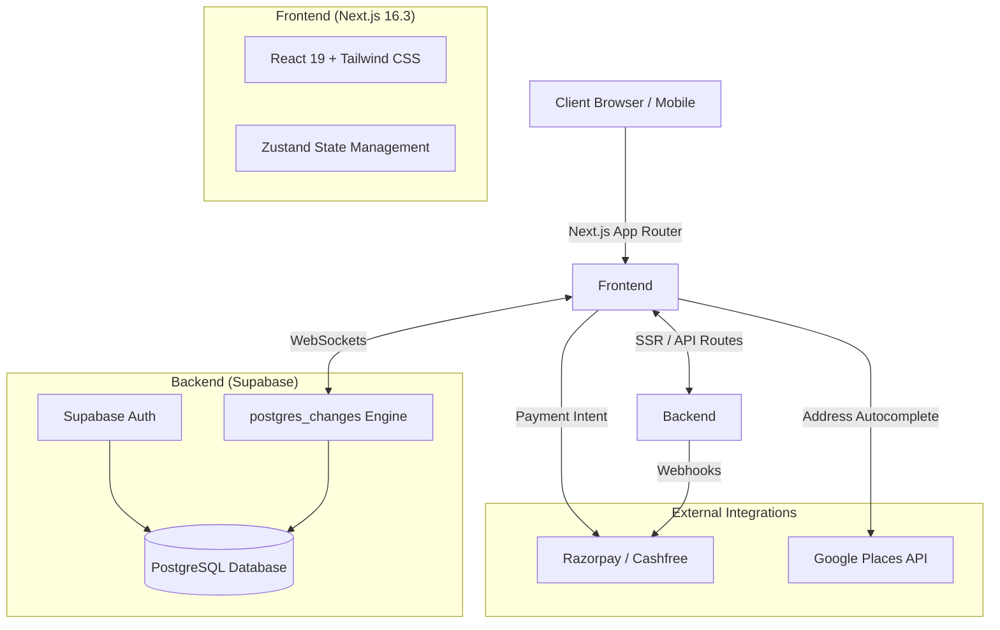
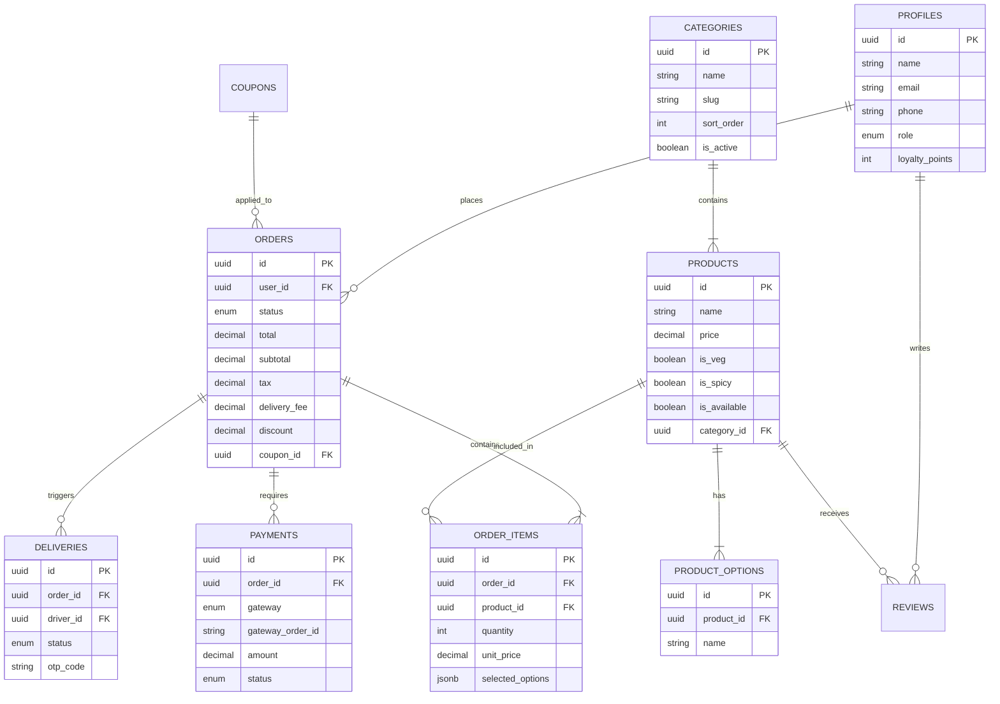
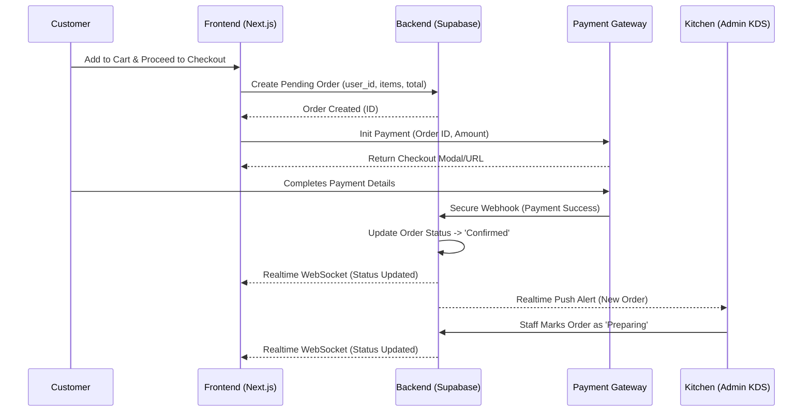

# Product Requirements Document (PRD): Pizza Expert Prayagraj

## 1. Executive Summary
**Pizza Expert Prayagraj** is a local, highly-rated fast-food pizzeria expanding its digital footprint with a bespoke, SaaS-quality online ordering platform. The platform is designed to increase direct sales, eliminate high commissions from third-party aggregators (like Zomato/Swiggy), and provide a superior customer experience. 

The application is a full-stack e-commerce web application featuring a consumer-facing storefront for seamless ordering and a comprehensive real-time admin dashboard for the restaurant staff to manage kitchen operations, deliveries, and catalog content.

---

## 2. Architecture & Tech Stack
The platform is built using modern, highly performant web technologies ensuring scalability, security, and developer ergonomics.

### System Architecture Diagram

### 2.1 Frontend Architecture
- **Framework:** Next.js 16.3 (App Router) ensuring Server-Side Rendering (SSR) for optimal SEO and fast time-to-interactive.
- **UI Library:** React 19.2.
- **Styling:** Tailwind CSS v4, providing utility-first styling. Theming is centralized in `theme.css` and `variables.css` utilizing custom CSS variables.
- **State Management:** Zustand (v5) for global state (e.g., Notification Store, Cart Store).
- **Component Primitives:** Radix UI (`@radix-ui/react-*`) for accessible, unstyled interactive components (Tabs, Accordions, Dialogs, Dropdowns, Sliders).
- **Form Handling:** React Hook Form integrated with Zod (`@hookform/resolvers`) for robust client and server validation.
- **Animations:** Framer Motion for micro-interactions and smooth page transitions.
- **Notifications:** Sonner for elegant toast notifications.
- **Icons:** Lucide React.
- **Data Visualization:** Recharts for admin dashboard analytics.

### 2.2 Backend Architecture (BaaS)
- **Database & Auth:** Supabase (PostgreSQL).
- **Real-time Engine:** Supabase Realtime (`postgres_changes`) powers live order updates, kitchen displays, and admin notifications without manual polling.
- **Data Fetching:** Handled via `@supabase/ssr` (Server-Side Rendering integration) providing authenticated server components.

---

## 3. Database Schema & Data Models
The data layer is built on a relational PostgreSQL database (via Supabase) with the following core entities:

### Entity Relationship Diagram (ERD)

- **Users & Profiles:** Role-based access control (`super_admin`, `manager`, `staff`, `viewer`, `customer`). Stores user details and loyalty points.
- **Catalog Management:**
  - **Categories:** Logical grouping (Pizza, Burger, Sides) with sort ordering and visibility flags.
  - **Products:** Core items containing price, description, dietary badges (`is_veg`, `is_spicy`), and nutritional info.
  - **Product Options & Choices:** Customizations (e.g., Size -> Regular, Large; Crust -> Thin, Cheese Burst) with dynamic price deltas.
  - **Modifiers:** Add-ons and extra toppings.
- **Orders & Fulfillment:**
  - **Orders:** Core transactional record capturing status (`pending`, `preparing`, `out_for_delivery`, `delivered`), financial totals, applied coupons, and delivery JSON data.
  - **Order Items:** Line items detailing the specific product, selected options, unit price, and quantity.
  - **Deliveries:** Maps orders to drivers, capturing status, pickup/delivery times, and proof of delivery.
  - **Drivers:** Fleet tracking data, including real-time coordinates, availability status, and vehicle information.
- **Payments:** Tracks transaction status, gateway utilized (Razorpay, Cashfree), and external transaction IDs.
- **Marketing & Content:** 
  - **Coupons:** Promotional codes with usage limits, minimum order values, and expiry dates.
  - **Reviews:** User-generated ratings and comments mapped to products.
  - **Blog & Gallery:** Content management tables for SEO articles and restaurant images.

---

## 4. Core Features Breakdown (Public Application)
The public-facing `/(public)` application is focused on conversion, speed, and mobile responsiveness.

### 4.1 Home & Discovery
- **Hero & Promo Banners:** Dynamic, high-impact visuals driving users to "Order Now".
- **Category Highlights:** Quick access tabs to featured categories and best-sellers.
- **Social Proof:** Aggregated Google reviews and an integrated Instagram feed.
- **SEO & Static Content:** Auto-generated sitemaps, structured JSON-LD data (Restaurant/Menu schemas), About Us, FAQ (accordion-style), and Policy pages.

### 4.2 Menu & Product Customization
- **Intelligent Filtering:** Users can filter the menu by dietary preferences (Veg-only) and sort by popularity or price.
- **Granular Customization:** The Product Detail Page (PDP) supports complex item configurations. Users can select sizes, crusts, and extra toppings. Price dynamically updates based on `price_delta`.
- **Dietary Badges:** Clear visual indicators for vegetarian and spicy items.

### 4.3 Cart & Checkout Flow
- **Persistent Cart:** Client-side cart management tracking items, quantities, and selected options.
- **Coupon Engine:** Input field to validate and apply promotional codes, calculating discounts in real-time against order subtotal and delivery fees.
- **Address Management:** Google Places API autocomplete ensures accurate delivery address capture. Authenticated users can save default addresses.
- **Multi-Gateway Payment:** 
  - **Razorpay:** For credit/debit cards, UPI, and Netbanking.
  - **Cashfree:** Secondary gateway integration.
  - **Cash on Delivery (COD):** Alternative payment mechanism.

### 4.4 Order Tracking
- **Live Timeline:** Customers can track their order status transitioning from `Confirmed` -> `Preparing` -> `Out for Delivery` -> `Delivered`.

---

## 5. Core Features Breakdown (Admin & Staff Dashboard)
The `/admin` portal is a secure, role-based workspace optimized for fast-paced restaurant operations.

### 5.1 Real-Time Operations Engine
- **Live Order Feed (`/admin/orders`):** Orders arrive in real-time without page refreshes. 
- **Notification System:** Global listener (`AdminLayout`) triggers browser desktop notifications, audio chimes, and UI toast alerts for every new incoming order. Managed by a centralized Zustand store (`useNotificationStore`).

### 5.2 Kitchen Display System (KDS) (`/admin/kitchen`)
- **Station-Specific Views:** Simplified interface designed for tablet displays in the kitchen. Focuses purely on items to be prepared, customized options, and order timers. 

### 5.3 Delivery Fleet Management (`/admin/deliveries`)
- **Dispatch Board:** Assign orders to available drivers.
- **Driver Tracking:** Monitor driver statuses (`is_online`, `is_busy`) and delivery milestones.

### 5.4 Catalog CMS (`/admin/products`)
- **Product Lifecycle:** Full CRUD interface for adding new menu items, uploading imagery, defining categorization, and setting nutritional info.
- **Option Builder:** Interface to create complex product configurations (e.g., defining a "Crust" option group and adding "Pan" (+₹0) and "Cheese Burst" (+₹75) choices).

### 5.5 Marketing & CRM (`/admin/coupons`, `/admin/customers`)
- **Offer Engine:** Generate percentage-based or flat-rate discount codes.
- **Customer Database:** View user order history, lifetime value, and loyalty points.

### 5.6 Design & Uniformity
- **Light Theme Standard:** All admin modules (including KDS and Delivery) adhere strictly to a uniform "Light Theme" established in `theme.css`. The UI utilizes responsive cards, truncated UUIDs, and optimized tables for high legibility.

---

## 6. External Integrations
1. **Supabase (BaaS):** Core database, Authentication, and Realtime WebSockets.
2. **Razorpay & Cashfree:** Secure payment processing SDKs and webhook listeners.
3. **Google Maps & Places API:** Store locator mapping and address autocomplete during checkout.
4. **WhatsApp (Potential Meta API):** Currently utilizes `wa.me` links for customer support.

---

## 7. Security & Authentication
- **Role-Based Access Control (RBAC):** Supabase Row Level Security (RLS) policies ensure that `staff` can view orders but cannot modify `products`, while `customers` can only view their own order history.
- **Environment Management:** API keys (Supabase anon/service keys, Razorpay keys) are strictly managed via environment variables (`.env.local`).
- **Data Purging Mechanisms:** System includes capabilities to perform secure `TRUNCATE CASCADE` operations to purge test data prior to production deployment.

---

## 8. System Workflows & Data Flow

### Order Lifecycle Data Flow (DFD)
This sequence diagram illustrates the flow of data from cart checkout through payment, to the kitchen display system.

---

## 9. Growth Opportunities & Future Roadmap

The application has a robust architectural foundation. To make the platform significantly more fruitful, the following features are recommended for immediate to mid-term implementation:

### Phase 1: Customization & Branding (Requested)
- **Dynamic Theme Editor:** Implement an admin interface to edit `theme.css` variables dynamically.
  - **Capabilities:** Change brand colors (Primary, Accent), typography (Google Fonts integration), Hero banner images, and static text blocks (FAQs, About Us) without redeploying code.

### Phase 2: Advanced Customer Retention
- **Tiered Loyalty Program:** Expand the current `loyalty_points` integer into a tiered system (Silver, Gold, VIP) unlocking free deliveries or exclusive items.
- **Automated Marketing (Abandoned Cart):** Track users who build a cart but fail to checkout. Integrate Twilio/SendGrid to send automated SMS/Email reminders with a 5% recovery discount 30 minutes later.

### Phase 3: Operational Scaling
- **Inventory & Recipe Engine:** Map "Products" to raw "Ingredients". Automatically decrement cheese and dough stock upon order placement. Trigger low-stock alerts and auto-disable menu items to prevent unfulfillable orders.
- **Dedicated Driver PWA:** Build a Progressive Web App specifically for delivery personnel to accept trips, route via Google Maps, and capture OTPs/Photos for Proof of Delivery.

### Phase 4: Omnichannel & AI Expansion
- **WhatsApp Conversational Bot:** Integrate the Meta WhatsApp Business API allowing users to text "Hi", view a native catalog, and place orders entirely within WhatsApp.
- **AI Upselling Engine:** Utilize machine learning (or simple algorithmic pairing) to analyze the cart and suggest highly-probable add-ons (e.g., suggesting a specific beverage based on the pizza selected).
