# 🍕 Pizza Expert Prayagraj — Product Requirements Document (PRD)

**Version:** 2.1 (Production Release - User Management & Fleet Edition)  
**Last Updated:** August 2026  
**Author:** Pratyush Malviya  
**Status:** 🟢 Active Production  
**Live URL:** https://pizza-kappa-nine.vercel.app  
**GitHub:** https://github.com/Pratyush-Malviya/pizza-expert-prayagraj

---

## Table of Contents

1. [Executive Summary](#1-executive-summary)
2. [Problem Statement & Business Goals](#2-problem-statement--business-goals)
3. [System Architecture](#3-system-architecture)
4. [Tech Stack](#4-tech-stack)
5. [Database Schema & Data Models](#5-database-schema--data-models)
6. [User Roles & Permissions](#6-user-roles--permissions)
7. [Public Storefront — Feature Spec](#7-public-storefront--feature-spec)
8. [Admin & Staff Dashboard — Feature Spec](#8-admin--staff-dashboard--feature-spec)
9. [External Integrations](#9-external-integrations)
10. [Security Model](#10-security-model)
11. [System Workflows & Data Flows](#11-system-workflows--data-flows)
12. [SEO & Performance Requirements](#12-seo--performance-requirements)
13. [Accessibility (WCAG 2.1 AA)](#13-accessibility-wcag-21-aa)
14. [Testing Plan](#14-testing-plan)
15. [Deployment & Infrastructure](#15-deployment--infrastructure)
16. [Implementation Roadmap](#16-implementation-roadmap)
17. [KPIs & Success Metrics](#17-kpis--success-metrics)
18. [Open Questions](#18-open-questions)

---

## 1. Executive Summary

**Pizza Expert Prayagraj** is a local, highly-rated fast-food pizzeria (Allapur, Prayagraj, UP) with a 4.9★ Google rating. The business currently relies on third-party aggregators (Zomato, Swiggy) which extract 20–30% commissions per order, eroding margins.

This document specifies a bespoke, **SaaS-quality** full-stack digital ordering platform designed to:

- ✅ **Capture direct orders** and eliminate aggregator commissions
- ✅ **Streamline kitchen operations** with a real-time Kitchen Display System
- ✅ **Retain customers** through loyalty, personalization, and automated marketing
- ✅ **Give the owner complete business visibility** through dashboards and analytics

The platform is a **Next.js 16.3 / React 19 / Supabase** application deployed on Vercel with a comprehensive admin portal for restaurant staff, and a polished consumer-facing storefront for online ordering.

---

## 2. Problem Statement & Business Goals

### 2.1 Current Pain Points

| Pain Point | Impact | Priority |
|---|---|---|
| 20–30% aggregator commission per order | Direct revenue loss | 🔴 Critical |
| No owned customer data or loyalty system | Zero retention leverage | 🔴 Critical |
| Manual order management across 3+ apps | Staff inefficiency, missed orders | 🟠 High |
| No real-time kitchen visibility | Preparation chaos, longer wait times | 🟠 High |
| No inventory awareness | Selling unavailable items, stockouts | 🟡 Medium |
| No financial reporting or GST automation | Owner blind to actual margins | 🟡 Medium |

### 2.2 Business Goals

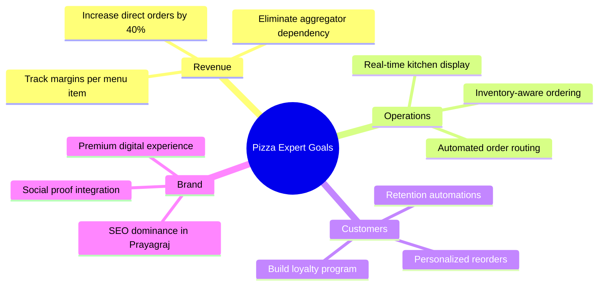

### 2.3 Target Users

| User Type | Description | Primary Need |
|---|---|---|
| **Hungry Customer** | Mobile-first, browsing food delivery options | Fast, frictionless ordering |
| **Loyal Regulars** | Repeat customers who want saved addresses & quick reorder | Speed & loyalty perks |
| **Super Admin** | Restaurant owner (Pratyush) | Business visibility & control |
| **Manager** | Shift manager, ops-focused | Order management, coupon creation |
| **Kitchen Staff** | Cooks who need a clear, simple display | Current orders with timers |
| **Delivery Driver** | On-the-road, mobile-first | Accept trips, navigation, OTP capture |

---

## 3. System Architecture

### 3.1 High-Level Architecture

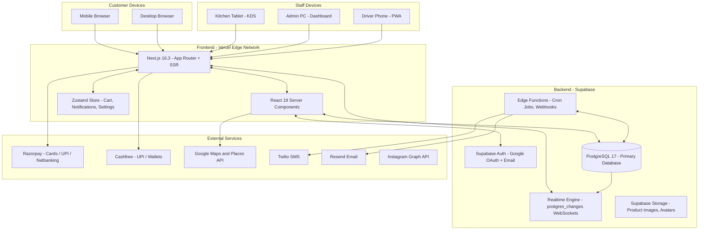

### 3.2 Request Flow (SSR vs CSR)

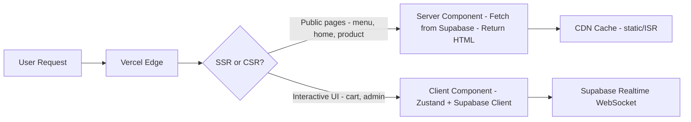

---

## 4. Tech Stack

### 4.1 Frontend

| Layer | Technology | Version | Purpose |
|---|---|---|---|
| Framework | **Next.js App Router** | 16.3.0 | SSR, routing, API routes |
| UI Library | **React** | 19.2.8 | Component model |
| Styling | **Tailwind CSS** | v4 | Utility-first CSS |
| State | **Zustand** | v5.0 | Global state (cart, notifications) |
| Components | **Radix UI** | Latest | Accessible headless components |
| Forms | **React Hook Form + Zod** | v7/v3 | Validation & form management |
| Animations | **Framer Motion** | v13 | Micro-interactions, transitions |
| Notifications | **Sonner** | v2 | Toast notifications |
| Icons | **Lucide React** | v1.30 | Icon system |
| Charts | **Recharts** | v3 | Admin analytics visualizations |
| Dates | **date-fns** | v4 | Date formatting and calculation |

### 4.2 Backend

| Layer | Technology | Purpose |
|---|---|---|
| Database | **Supabase PostgreSQL 17** | Primary relational data store |
| Auth | **Supabase Auth** | Email/password + Google OAuth |
| Realtime | **Supabase Realtime** | WebSocket postgres_changes for live order updates |
| Storage | **Supabase Storage** | Image uploads (products, avatars, UGC) |
| Edge Functions | **Supabase Edge Functions** | Cron jobs, webhooks, serverless logic |
| ORM Layer | **@supabase/ssr + @supabase/supabase-js** | Server and browser Supabase clients |

### 4.3 Payments & Integrations

| Service | SDK/API | Use Case |
|---|---|---|
| **Razorpay** | REST API + Checkout.js | Cards, UPI, Netbanking |
| **Cashfree** | Web SDK | UPI wallets, secondary gateway |
| **Google Maps** | Places API | Address autocomplete at checkout |
| **Google Business** | Business API | Reviews and ratings display |
| **Instagram** | Graph API | Home page feed carousel |
| **Twilio** | REST API | SMS order notifications |
| **Resend** | API | Transactional emails |

### 4.4 Infrastructure

| Layer | Technology | Details |
|---|---|---|
| Hosting | **Vercel** | Global CDN, automatic deployments |
| CI/CD | **GitHub → Vercel** | Push to master triggers deploy |
| Error Tracking | **Sentry** | Runtime error monitoring |
| Analytics | **Google Analytics 4** | Traffic and conversion tracking |
| Ad Tracking | **Meta Pixel** | Facebook/Instagram ad attribution |

---

## 5. Database Schema & Data Models

### 5.1 Full Entity Relationship Diagram

```mermaid
erDiagram
    PROFILES {
        uuid id PK
        string name
        string email
        string phone
        enum role
        boolean is_active
        string invite_status
        uuid invited_by FK
        timestamp last_login_at
        int loyalty_points
        jsonb notification_prefs
        timestamp created_at
    }

    STAFF_DETAILS {
        uuid id PK_FK
        string department
        string employee_code
        date hire_date
        string shift_pattern
        decimal hourly_rate
    }

    DRIVER_DETAILS {
        uuid id PK_FK
        enum vehicle_type
        string vehicle_number
        string license_number
        enum verification_status
        string rejection_reason
        boolean is_online
    }

    AUDIT_LOG {
        uuid id PK
        uuid actor_id FK
        string action
        string target_table
        string target_id
        jsonb before
        jsonb after
        string ip_address
        timestamp created_at
    }

    USER_SESSIONS {
        uuid id PK
        uuid user_id FK
        string device_info
        string ip_address
        timestamp created_at
        timestamp revoked_at
    }

    LOYALTY_TIERS {
        uuid id PK
        string name
        int min_points
        jsonb perks
    }

    CATEGORIES {
        uuid id PK
        string name
        string slug
        string icon_url
        int sort_order
        boolean is_active
    }

    PRODUCTS {
        uuid id PK
        string name
        string slug
        text description
        decimal base_price
        decimal cost_price
        boolean is_veg
        boolean is_spicy
        boolean is_available
        string image_url
        int calories
        uuid category_id FK
        timestamp created_at
    }

    PRODUCT_OPTIONS {
        uuid id PK
        uuid product_id FK
        string name
        string type
    }

    OPTION_CHOICES {
        uuid id PK
        uuid option_id FK
        string label
        decimal price_delta
    }

    INGREDIENTS {
        uuid id PK
        string name
        string unit
        decimal current_stock
        decimal reorder_threshold
        date expiry_date
        uuid supplier_id FK
    }

    RECIPE_ITEMS {
        uuid id PK
        uuid product_id FK
        uuid ingredient_id FK
        decimal quantity_required
    }

    SUPPLIERS {
        uuid id PK
        string name
        string contact
        string payment_terms
    }

    ORDERS {
        uuid id PK
        uuid user_id FK
        enum status
        enum order_type
        decimal subtotal
        decimal tax
        decimal delivery_fee
        decimal discount
        decimal total
        uuid coupon_id FK
        jsonb address_json
        uuid table_id FK
        enum source
        string external_order_id
        timestamp created_at
    }

    ORDER_ITEMS {
        uuid id PK
        uuid order_id FK
        uuid product_id FK
        int quantity
        decimal unit_price
        jsonb selected_options
    }

    PAYMENTS {
        uuid id PK
        uuid order_id FK
        enum gateway
        string gateway_order_id
        string gateway_payment_id
        decimal amount
        enum status
        timestamp paid_at
    }

    DELIVERIES {
        uuid id PK
        uuid order_id FK
        uuid driver_id FK
        enum status
        string otp_code
        boolean otp_verified
        string proof_photo_url
        timestamp picked_up_at
        timestamp delivered_at
    }

    TABLES {
        uuid id PK
        string table_number
        string qr_code_url
        boolean is_active
    }

    COUPONS {
        uuid id PK
        string code
        enum discount_type
        decimal discount_value
        decimal min_order_value
        int max_uses
        int used_count
        timestamp expires_at
        boolean is_active
    }

    REVIEWS {
        uuid id PK
        uuid product_id FK
        uuid user_id FK
        int rating
        text comment
        string image_url
        boolean is_approved
        timestamp created_at
    }

    CART_SESSIONS {
        uuid id PK
        uuid user_id FK
        jsonb items
        timestamp last_updated
        boolean recovered
    }

    TAX_INVOICES {
        uuid id PK
        uuid order_id FK
        string invoice_number
        string gstin
        decimal cgst
        decimal sgst
        decimal igst
        timestamp generated_at
    }

    PROFILES ||--o{ ORDERS : places
    PROFILES ||--o{ REVIEWS : writes
    PROFILES ||--o{ CART_SESSIONS : has
    PROFILES }|--|| LOYALTY_TIERS : belongs_to
    CATEGORIES ||--|{ PRODUCTS : contains
    PRODUCTS ||--|{ PRODUCT_OPTIONS : has
    PRODUCT_OPTIONS ||--|{ OPTION_CHOICES : offers
    PRODUCTS ||--|{ RECIPE_ITEMS : composed_of
    RECIPE_ITEMS }|--|| INGREDIENTS : uses
    INGREDIENTS }|--|| SUPPLIERS : supplied_by
    ORDERS ||--|{ ORDER_ITEMS : contains
    ORDERS ||--o{ DELIVERIES : triggers
    ORDERS ||--o{ PAYMENTS : requires
    ORDERS ||--o{ TAX_INVOICES : generates
    ORDERS }o--|| TABLES : at
    PRODUCTS ||--o{ ORDER_ITEMS : included_in
    COUPONS ||--o{ ORDERS : applied_to
```

### 5.2 Order Status State Machine

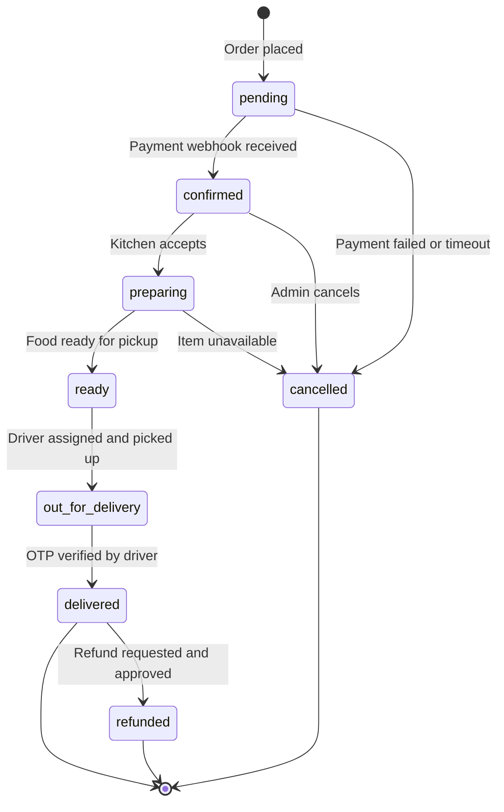

---

## 6. User Roles & Permissions

| Feature | Super Admin | Manager | Staff | Viewer | Customer | Driver |
|---|:---:|:---:|:---:|:---:|:---:|:---:|
| All admin access | ✅ | ❌ | ❌ | ❌ | ❌ | ❌ |
| Manage users & roles | ✅ | ❌ | ❌ | ❌ | ❌ | ❌ |
| Customer CRM & User CRUD (Add/Edit/Delete) | ✅ | ✅ | ❌ | ❌ | ❌ | ❌ |
| View Customer Action Trace & LTV | ✅ | ✅ | ❌ | ❌ | ❌ | ❌ |
| Manage Driver Fleet & Verify KYC | ✅ | ✅ | ❌ | ❌ | ❌ | ❌ |
| Security & Audit Log Trail | ✅ | ✅ | ❌ | ❌ | ❌ | ❌ |
| Manage products & menu | ✅ | ✅ | ❌ | ❌ | ❌ | ❌ |
| Manage orders & status | ✅ | ✅ | ✅ | ❌ | ❌ | ❌ |
| KDS (kitchen view) | ✅ | ✅ | ✅ | ❌ | ❌ | ❌ |
| Create coupons | ✅ | ✅ | ❌ | ❌ | ❌ | ❌ |
| View analytics | ✅ | ✅ | ❌ | ✅ | ❌ | ❌ |
| Manage site settings | ✅ | ❌ | ❌ | ❌ | ❌ | ❌ |
| Self-Service Account & Preferences | ❌ | ❌ | ❌ | ❌ | ✅ | ❌ |
| Accept & Complete Deliveries | ❌ | ❌ | ❌ | ❌ | ❌ | ✅ |

---

## 7. Public Storefront — Feature Spec

### 7.1 Site Map

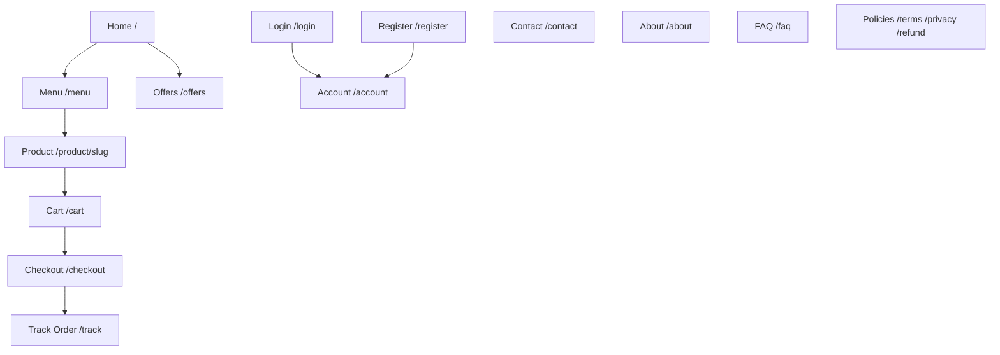

### 7.2 Home Page Sections

| Section | Component | Content | Priority |
|---|---|---|---|
| **Hero Banner** | `HeroBanner` | Full-width food photography, headline, "Order Now" CTA | 🔴 Critical |
| **Promo Cards** | `PromoCards` | 3–4 featured daily deals/offers with images | 🟠 High |
| **Category Tabs** | `CategoryTabs` | Pizza, Burgers, Pasta, Beverages tabs with 3 products each | 🟠 High |
| **Best Sellers** | `ProductGrid` | Top-selling items based on order count | 🟠 High |
| **Feature Icons** | `FeatureIcons` | "Best Quality", "Fast Delivery", "Master Chefs", "Fresh Ingredients" | 🟡 Medium |
| **Instagram Feed** | `InstagramCarousel` | Latest posts from Instagram Graph API | 🟡 Medium |
| **Google Reviews** | `ReviewsSlider` | Aggregated Google rating 4.9 stars + recent reviews | 🟡 Medium |
| **FAQ Snippet** | `FAQAccordion` | Top 5 questions with expandable answers | 🟢 Low |
| **Footer** | `Footer` | Logo, quick links, contact, hours, social icons, payment badges | 🔴 Critical |

### 7.3 Cart & Checkout Flow

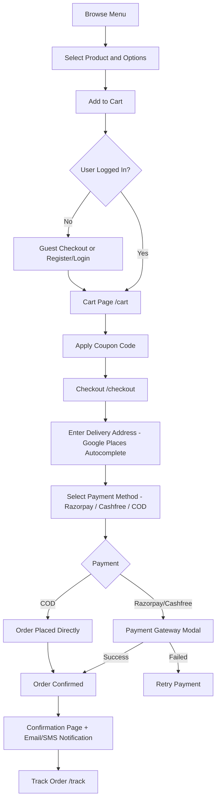

### 7.4 Order Tracking — Live Timeline

```
Confirmed  →  Preparing  →  Ready  →  Out for Delivery  →  Delivered
```

- Customer receives push notification (toast + browser notification) on each status change
- OTP displayed on tracking page for driver verification at delivery

### 7.5 Customer Account

| Section | Features |
|---|---|
| **Profile** | Name, phone, email, avatar upload |
| **Notification Preferences** | SMS, WhatsApp & Email toggles for order updates and promo deals |
| **Privacy & GDPR Data Export** | One-click JSON download of complete profile, addresses, and order history |
| **Account Deactivation** | Self-service account soft-deactivation with 30-day grace period |
| **Saved Addresses** | Add/edit/delete normalized addresses, set default |
| **Order History** | All past orders with live status, items, unit prices, total |
| **Quick Reorder** | One-click replay of last order |
| **Loyalty Points** | Current points balance, tier status, perks, retention ledger |

---

## 8. Admin & Staff Dashboard — Feature Spec

### 8.1 Admin Navigation Structure

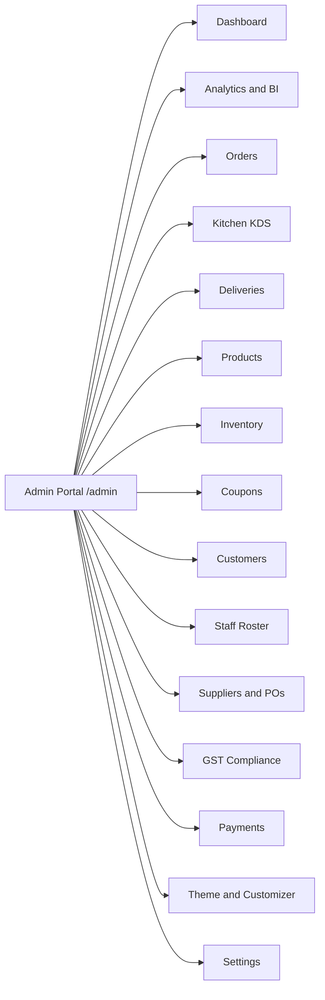

### 8.2 Real-Time Operations Engine

All admin operations run on **Supabase Realtime** (`postgres_changes`). No polling required.

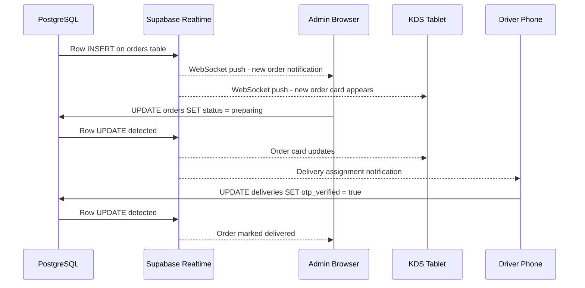

**Admin Notification Triggers:**
- New order → toast + audio chime + browser desktop notification
- Low stock alert → in-app banner
- Payment failure → error toast with order details

### 8.3 Dashboard (Home)

| Widget | Data Source | Visualization |
|---|---|---|
| Today's Revenue | orders table (today) | Large number + delta vs yesterday |
| Orders Today | orders COUNT | Number card |
| Active Orders | orders WHERE status != delivered | Live counter |
| Best Sellers Today | order_items JOIN products | Horizontal bar chart |
| Revenue (7 days) | daily_revenue_summary view | Area chart (Recharts) |
| Orders by Category | order_items GROUP BY category | Donut chart |
| New Customers | profiles (today) | Number card |
| Pending Tasks | Low stock + unread reviews | Alert list |

### 8.4 Kitchen Display System (KDS) — /admin/kitchen

Designed for a **10" tablet** mounted in the kitchen:

- Cards for each active order (status: confirmed or preparing)
- Each card: Order number, items with quantities, customizations highlighted, timer
- One-click status update: Confirmed → Preparing → Ready
- Audio alert on new order arrival
- Color-coded urgency: Fresh (green) / Waiting more than 10 min (yellow) / Urgent more than 20 min (red)

### 8.5 Catalog CMS — /admin/products

- **Categories:** Add/edit/reorder/toggle categories with icon upload
- **Products:** Full CRUD with image upload, pricing, dietary flags, availability toggle, nutritional info, SEO fields
- **Option Builder:** Create option groups (e.g. "Size") and choices (e.g. "Regular +0", "Large +80")
- **Inventory Link:** See current stock status from product card

### 8.6 Coupon Engine — /admin/coupons

| Field | Description |
|---|---|
| Code | Alphanumeric, case-insensitive |
| Type | percentage or flat |
| Value | Discount amount |
| Min Order | Minimum order value to apply |
| Max Uses | Total redemption limit |
| Expiry | Date/time expiry |
| Status | Active / Paused / Expired |

### 8.7 GST Compliance — /admin/gst

- Auto-generated GST-compliant PDF invoices per order
- Sequential invoice numbering (GST-required)
- Tax breakdown: CGST + SGST + IGST
- Export: Date-range CSV for accountant handoff
- Print-ready invoice template

### 8.8 Customer CRM Directory & User Management — /admin/customers

- **Unified Customer Aggregation:** Combines registered user profiles (`profiles`) and guest checkout customers (automatically extracted from `orders.address_json`).
- **Lifetime Value (LTV) Metrics:** Displays total orders placed, cumulative spending (₹ LTV), and last order timestamp.
- **Detailed Customer Action Trace (Eye Icon 👁️):**
  - *Order History Tab:* Itemized breakdown of past orders, statuses, and totals.
  - *Saved Addresses Tab:* Normalized delivery locations (Home, Work, Pincode).
  - *Detailed Action Trace Tab:* Real-time timeline of customer audit events (logins, order placements, address changes, profile edits, IP addresses).
- **User CRUD & Account Management:**
  - *Add New User Modal:* Create new user accounts directly from the CRM with role selection.
  - *Edit User Modal:* Modify name, phone, role, loyalty points, and active/blocked status.
  - *Delete User Confirmation Modal:* Soft/hard delete user profiles with full audit trail logging.
- **Loyalty Ledger & Rewards Adjustments:** Manual point grants/deductions with custom reason notes.
- **Data Export & Seeding:** Client-side CSV export of filtered records + 1-click sample demo customer seeding.

### 8.9 Security & Audit Log Trail — /admin/audit-log

- **Event Compliance Trace:** Centralized activity log capturing administrative actions, role modifications, customer blocks, and system events.
- **Before / After JSON State Diffs:** Collapsible diff viewer displaying exact state changes per action.
- **Actor & IP Resolution:** Resolves actor user IDs to human-readable names and logs requesting IP addresses.
- **Compliance Export:** One-click CSV export for security audits and management review.

### 8.10 Driver Fleet & KYC Onboarding — /admin/drivers

- **Fleet Roster & Duty Status:** Manage delivery drivers, vehicle types (Bike, Scooter, E-Bike, Car), and license plate numbers.
- **Online/Offline Realtime Toggle:** One-click switch for driver availability.
- **Document KYC Workflow:** Inspect driving licenses and ID proofs with *Approve & Verify* or *Reject* (with mandatory rejection reason input).
- **Fleet KPI Metrics:** Live cards displaying *Total Fleet*, *Online Now*, and *Pending KYC Review*.

### 8.11 Staff Roster & Access Controls — /admin/staff

- **Team Roster:** Manage kitchen staff, managers, and super admins.
- **Department & Employee Code:** Assign operational departments (Kitchen, Dispatch, Inventory) and employee codes.
- **Instant Deactivation & Session Revocation:** Soft-deactivate accounts with instant global auth session invalidation (`signOut(userId, 'global')`).
- **Last Login Tracking:** Displays `last_login_at` timestamps for operational visibility.

---

## 9. External Integrations

```mermaid
graph TB
    Platform["Pizza Expert Platform"]

    Platform <-->|"Auth + DB + Realtime"| Supabase["Supabase BaaS Core"]
    Platform -->|"Payment Intent + Webhook"| Razorpay["Razorpay"]
    Platform -->|"Payment Intent + Webhook"| Cashfree["Cashfree"]
    Platform -->|"Address Autocomplete"| GMaps["Google Maps Places API"]
    Platform -->|"Business Reviews"| GBusiness["Google Business Profile API"]
    Platform -->|"Social Feed"| Instagram["Instagram Graph API"]
    Platform -->|"Order SMS"| Twilio["Twilio SMS"]
    Platform -->|"Transactional Email"| Resend["Resend"]
    Platform -->|"Error Monitoring"| Sentry["Sentry"]
    Platform -->|"Analytics"| GA4["Google Analytics 4"]
    Platform -->|"Ad Tracking"| MetaPixel["Meta Pixel"]
    Platform -->|"Future - Order Push"| Zomato["Zomato API Phase 3"]
    Platform -->|"Future - Order Push"| Swiggy["Swiggy API Phase 3"]
```

| Integration | Status | Priority |
|---|---|---|
| Supabase (DB, Auth, Realtime) | ✅ Live | Core |
| Razorpay | 🟡 Test mode | 🔴 Critical |
| Google Maps / Places | 🟡 Configured | 🟠 High |
| Resend (email) | ✅ Configured | 🟠 High |
| Instagram Graph API | 🟡 Token needed | 🟡 Medium |
| Google Business Reviews | 🔴 Not started | 🟡 Medium |
| Twilio SMS | 🔴 Not started | 🟡 Medium |
| Meta Pixel | 🔴 Not started | 🟢 Low |
| Zomato/Swiggy API | 🔴 Phase 3 | 🟢 Future |

---

## 10. Security Model

### 10.1 Row Level Security (RLS)

| Table | Customer Policy | Staff Policy | Admin Policy |
|---|---|---|---|
| `orders` | Own rows only | All rows (read) | Full access |
| `profiles` | Own row only | Own + assigned | All rows |
| `products` | Read only | Read only | Full CRUD |
| `reviews` | Own + approved | Read all | Full CRUD |
| `payments` | Own only | Read all | Full access |

### 10.2 API Key Security

| Key | Storage | Exposure |
|---|---|---|
| `NEXT_PUBLIC_SUPABASE_URL` | .env.local + Vercel | Public (safe) |
| `NEXT_PUBLIC_SUPABASE_ANON_KEY` | .env.local + Vercel | Public (RLS protected) |
| `SUPABASE_SERVICE_ROLE_KEY` | .env.local + Vercel | Server-only NEVER expose |
| `RAZORPAY_KEY_SECRET` | .env.local + Vercel | Server-only |
| `RESEND_API_KEY` | .env.local + Vercel | Server-only |

### 10.3 Auth Flow

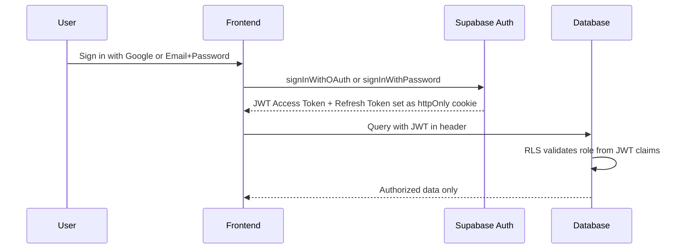

**Strict Authentication Enforcement:** 
- All legacy "one-click" admin bypasses and hardcoded demo credentials have been fully removed. Authentication strictly requires valid Supabase email/password verification or Google OAuth. 
- Active sessions are securely terminated on logout across both customer and admin portals by destroying the Supabase auth session and clearing any legacy admin cookies.

---

## 11. System Workflows & Data Flows

### 11.1 Complete Order Lifecycle

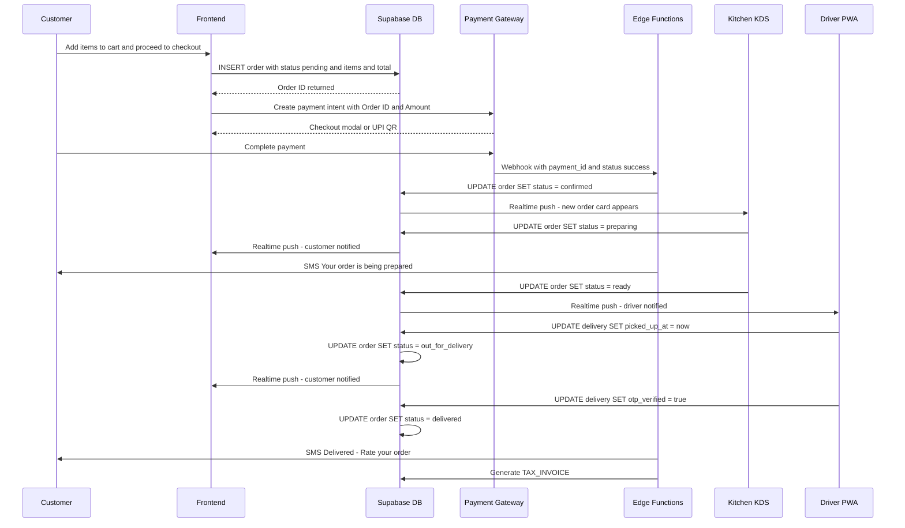

### 11.2 Abandoned Cart Recovery Flow

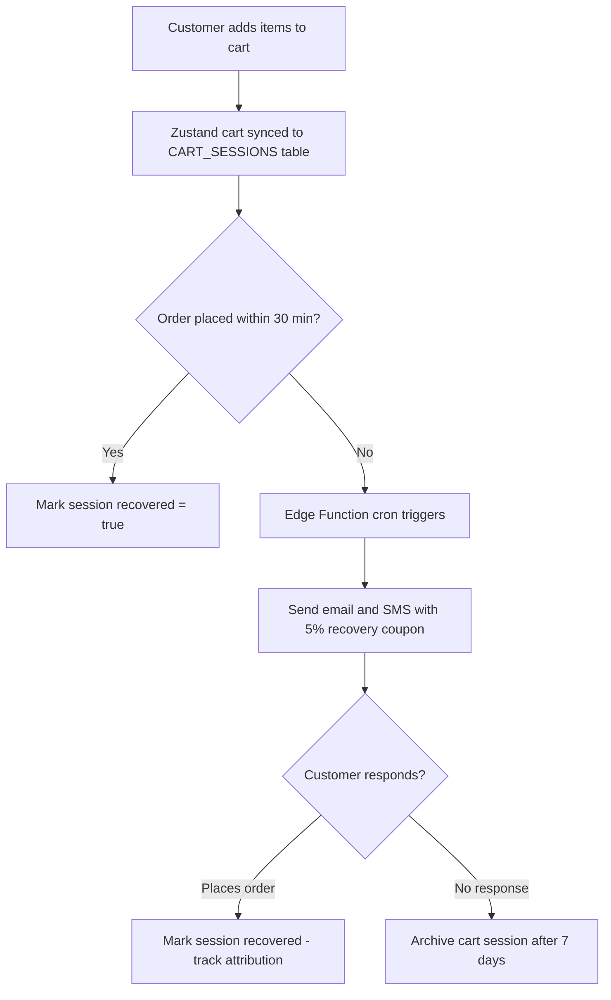

### 11.3 Inventory Auto-Disable Flow

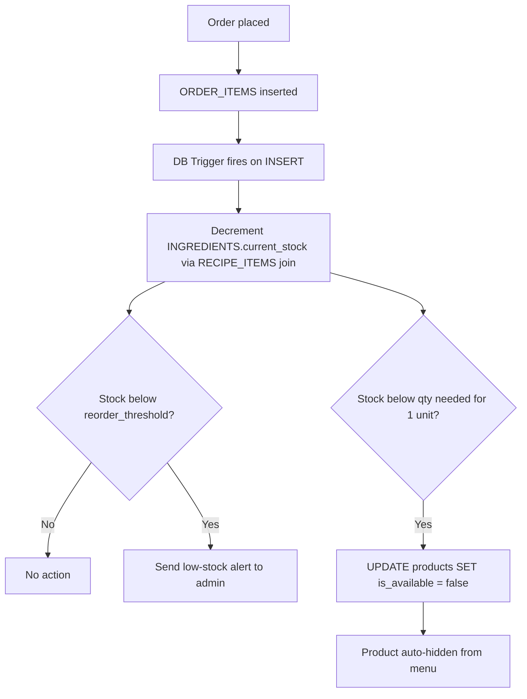

---

## 12. SEO & Performance Requirements

### 12.1 Structured Data (JSON-LD)

| Page | Schema Type |
|---|---|
| Home | Restaurant, Organization, WebSite |
| Menu | Menu, MenuSection |
| Product Detail | MenuItem, Product, AggregateRating |
| FAQ | FAQPage |
| Blog Post | Article, BreadcrumbList |
| All Pages | BreadcrumbList |

### 12.2 Core Web Vitals Targets

| Metric | Target | Technique |
|---|---|---|
| **LCP** (Largest Contentful Paint) | < 2.5s | Hero image priority loading, CDN |
| **INP** (Interaction to Next Paint) | < 200ms | RSC, minimize client JS |
| **CLS** (Cumulative Layout Shift) | < 0.1 | Explicit image dimensions |
| **TTFB** (Time to First Byte) | < 600ms | Vercel Edge SSR, ISR for static pages |
| **Lighthouse Score** | >= 90 | All of the above |

---

## 13. Accessibility (WCAG 2.1 AA)

| Requirement | Implementation |
|---|---|
| **Color Contrast** | 4.5:1 minimum for all text on backgrounds |
| **Keyboard Navigation** | Tab order follows visual order; skip-to-content link |
| **Screen Reader Support** | Semantic HTML, aria-label, aria-expanded, role attributes |
| **Form Accessibility** | Every input has an associated label |
| **Focus Management** | Visible focus rings; modals trap focus |
| **Images** | Descriptive alt text on food images; alt="" on decorative images |
| **Motion** | Respects prefers-reduced-motion media query |
| **Font Size** | 16px base minimum; scalable up to 200% zoom |
| **Touch Targets** | Minimum 44x44px tap targets on mobile |
| **Error Messages** | Descriptive, associated with the failing field |

---

## 14. Testing Plan

| Test Type | Tool | Coverage Target |
|---|---|---|
| **Unit Tests** | Jest + React Testing Library | Cart logic, coupon engine, form validation |
| **Integration Tests** | Playwright | Auth flow, order placement, payment stub |
| **E2E Tests** | Playwright | Full order cycle: browse to cart to checkout to confirmation |
| **Visual Regression** | Playwright screenshots | Homepage, product detail, checkout |
| **Accessibility** | axe-core + manual (NVDA/VoiceOver) | All public pages |
| **Performance** | Lighthouse CI | Every deployment on master |
| **Cross-Browser** | BrowserStack | Chrome, Firefox, Safari, Edge + iOS Safari, Android Chrome |
| **Security** | OWASP checklist + Supabase RLS tests | All API routes, auth bypass attempts |
| **UAT** | Pizza Expert staff | Full order flow before production launch |

---

## 15. Deployment & Infrastructure

### 15.1 Deployment Pipeline

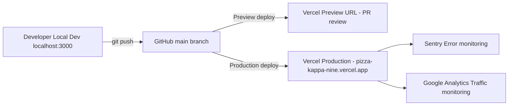

### 15.2 Required Environment Variables

| Variable | Environment | Required |
|---|---|---|
| `NEXT_PUBLIC_SUPABASE_URL` | All | ✅ |
| `NEXT_PUBLIC_SUPABASE_ANON_KEY` | All | ✅ |
| `SUPABASE_SERVICE_ROLE_KEY` | Server only | ✅ |
| `NEXT_PUBLIC_RAZORPAY_KEY_ID` | All | ✅ |
| `RAZORPAY_KEY_SECRET` | Server only | ✅ |
| `RESEND_API_KEY` | Server only | ✅ |
| `NEXT_PUBLIC_APP_URL` | All | ✅ |
| `GOOGLE_CLIENT_ID` | Server | ✅ |
| `GOOGLE_CLIENT_SECRET` | Server | ✅ |
| `GOOGLE_MAPS_API_KEY` | Server | 🟡 |
| `INSTAGRAM_ACCESS_TOKEN` | Server | 🟡 |
| `TWILIO_ACCOUNT_SID` | Server | 🟡 |
| `TWILIO_AUTH_TOKEN` | Server | 🟡 |
| `SENTRY_DSN` | All | 🟢 |

### 15.3 Launch Checklist

- [ ] All environment variables set in Vercel Production
- [ ] Supabase RLS policies verified on all tables
- [ ] Razorpay switched from test to live mode
- [ ] Google OAuth redirect URIs include production domain
- [ ] Supabase auth redirect URLs include production domain
- [ ] Error monitoring (Sentry) verified working
- [ ] Google Search Console sitemap submitted
- [ ] All payment flows end-to-end tested in production
- [ ] Staff training on admin panel completed

---

## 16. Implementation Roadmap

### Current State (v2.1 — Live Production)

✅ Next.js 16.3 + React 19 + Tailwind v4  
✅ Supabase auth (Google OAuth + email/password) — **Strict enforcement, all bypasses removed**  
✅ Vibrant Modern UI — Dynamic vibrant green & yellow accents across primary workflows  
✅ Full menu browsing with filters and customization  
✅ Cart + checkout with coupon engine  
✅ Razorpay + Cashfree + COD payment  
✅ Real-time admin order feed with audio + desktop notifications  
✅ Kitchen Display System (KDS) & Delivery dispatch board  
✅ Catalog CMS (products, categories, options)  
✅ Staff Roster with department tags, status badges & instant session revocation  
✅ **User Management Module (Milestones A - F Completed):**  
  - 👥 **Customer CRM Directory (`/admin/customers`):** Registered & Guest Customer aggregation, LTV calculation, User CRUD (Add, Edit, Delete modals), loyalty adjustments, CSV export.  
  - 👁️ **Detailed Customer Action Trace:** Itemized order history tab, saved addresses tab, and real-time audit log timeline tab per customer.  
  - 🛡️ **Security & Audit Log Trail (`/admin/audit-log`):** Centralized event trail with before/after JSON state diffs and CSV export.  
  - 🚚 **Driver Fleet & KYC Onboarding (`/admin/drivers`):** Fleet KPI metrics, vehicle classification, document KYC review (Approve/Reject), online status toggle.  
  - ⚙️ **Self-Service Account (`/account/profile`):** SMS/Email notification toggles, GDPR personal data export (JSON download), 30-day account deactivation.  
✅ Theme & Customizer  

### Phased Roadmap

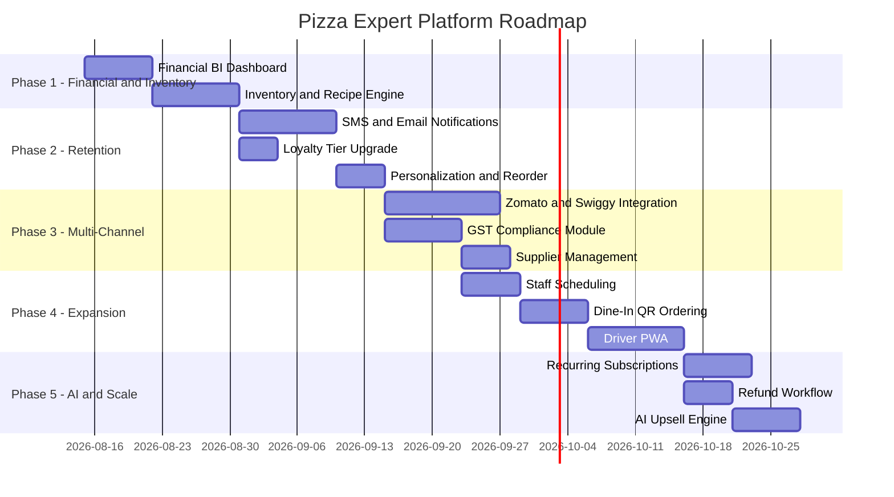

### Phase Summary

| Phase | Focus | Duration | Priority | Effort |
|---|---|---|---|---|
| **1** | Financial BI Dashboard + Inventory Engine | 2.5–3 weeks | 🔴 Critical | ~16 dev days |
| **2** | Retention messaging + Loyalty tiers + Quick reorder | 3–3.5 weeks | 🟠 High | ~18 dev days |
| **3** | Multi-channel (Zomato/Swiggy) + GST + Suppliers | 4–4.5 weeks | 🟠 High | ~25 dev days |
| **4** | Staff scheduling + Dine-in QR + Driver PWA | 4.5 weeks | 🟡 Medium | ~23 dev days |
| **5** | Subscriptions + Refunds + AI upsell | 3–4 weeks | 🟢 Future | ~22 dev days |

**Total with 1 developer (sequential): ~18–20 weeks**  
**Total with 2 developers (parallel): ~10–12 weeks**

### Phase 1 — Financial Visibility & Inventory

**Phase 1A: Financial / BI Dashboard**
- Revenue graphs (daily/weekly/monthly) using existing Recharts
- Top 10 products by revenue and quantity
- AOV, coupon spend vs revenue lift, discount analysis
- New Supabase views: `daily_revenue_summary`, `product_performance_summary`
- New column: `PRODUCTS.cost_price` for margin calculation

**Phase 1B: Inventory & Recipe Engine**
- New tables: `INGREDIENTS`, `RECIPE_ITEMS`
- DB trigger: auto-decrement stock on `ORDER_ITEMS` insert
- Auto-disable product when stock insufficient
- Low-stock and expiry alerts (in-app + email)
- Admin UI: `/admin/inventory` with restock entry

### Phase 2 — Customer Retention

**Phase 2A: Transactional & Retention Messaging**
- Twilio SMS + Resend email on order status changes
- Abandoned cart recovery (30-min idle → email/SMS + 5% coupon)
- Win-back campaign (no order in 30 days)
- Birthday offer automation
- New tables: `CART_SESSIONS`, `NOTIFICATIONS_LOG`
- New column: `PROFILES.date_of_birth`

**Phase 2B: Loyalty Tier System**
- Silver / Gold / VIP tiers with thresholds and perks
- Perks: free delivery, early access, exclusive discounts
- New tables: `LOYALTY_TIERS`
- New column: `PROFILES.tier_id`

**Phase 2C: Personalization**
- Quick reorder (replay last order into cart)
- "Frequently bought together" (co-occurrence SQL query)
- UGC photo upload on reviews

---

## 17. KPIs & Success Metrics

| KPI | Current | 3-Month Target | 6-Month Target |
|---|---|---|---|
| Direct orders / day | Baseline | +40% | +100% |
| Aggregator commission saved | 0 | 10,000+/mo (INR) | 25,000+/mo (INR) |
| Cart-to-checkout conversion | Baseline | 35% | 50% |
| Repeat customer rate | Baseline | 30% | 45% |
| Average Order Value (AOV) | Baseline | +15% | +25% |
| Customer satisfaction (reviews) | 4.9 stars | Maintain 4.9 stars | 5.0 goal |
| Admin order processing time | Baseline | -30% | -50% |
| Lighthouse score | Baseline | >= 90 | >= 95 |

---

## 18. Open Questions

> These questions must be resolved with the owner before development of certain phases begins.

| # | Question | Impacts |
|---|---|---|
| 1 | Will Zomato/Swiggy continue alongside the direct platform? | Priority of Phase 3A |
| 2 | Is dine-in a real use case, or delivery/takeaway only? | Whether Phase 4B is needed |
| 3 | Who handles GST filing — in-house or accountant? | Invoice template format in Phase 3B |
| 4 | Is there existing POS/accounting software (Tally, Marg)? | Integration requirements |
| 5 | What is the biggest daily pain point today? | Phase 1 vs Phase 3 priority |
| 6 | Are there delivery drivers employed by the restaurant? | Phase 4C requirements |
| 7 | What is the current average number of orders per day? | Capacity planning and throttling logic |

---

*This PRD is a living document. As features ship and the platform evolves, sections will be updated to reflect the current state of the product.*

*Last updated: August 2026 by Pratyush Malviya*  
*Companion documents: `pizza_expert_roadmap.md`, `DESIGN.md`*
